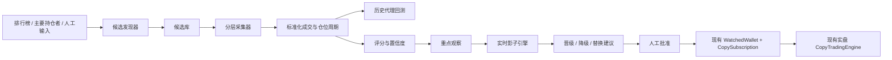
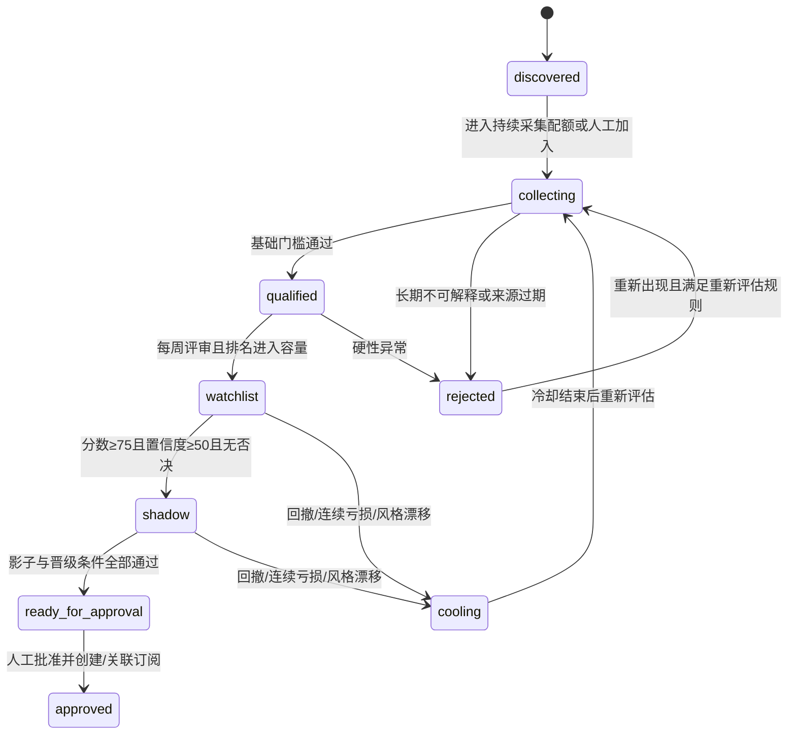

# Polymarket 优质钱包发现与评分系统功能实现文档 V1

> 文档状态：可进入开发评审
> 编写日期：2026-08-14
> 需求依据：`docs/wallet-discovery-scoring-design-v1.md`
> 适用仓库：PolyCopy（FastAPI + SQLAlchemy + SQLite + Next.js）

## 1. 结论与实施边界

### 1.1 合理性结论

该需求合理，建议立项，并在现有 PolyCopy 系统内作为独立业务模块实现。

现有系统已经具备稳定持仓事件、公开成交、归因订单、实际成交、手续费、盈亏、全局风控、`active` 与 `exit_only` 状态，以及人工确认实盘的能力。新增模块应解决上游的候选发现、可复制性评估和进入实盘前验证，不应另建一套交易执行系统。

V1 的产品边界确定为：

> 自动发现候选、自动采集、自动评分、历史代理回测、实时影子跟单、自动生成晋级/降级/替换建议；任何真实资金启用仍复用现有 `CopySubscription` 和人工确认流程。

### 1.2 已确认的三项产品决策

1. V1 覆盖候选发现、历史档案、评分、历史回测、影子跟单、人工批准和替换建议；不自动启用或替换实盘钱包。
2. 不新增自动使用真实资金的“试运行状态”。候选批准后创建或关联现有实盘策略，仍由用户在现有页面确认额度并开启。
3. 回测和影子跟单不写死资金参数。每次运行绑定不可变的执行参数快照，默认从当时的执行账户和评估策略模板生成。

### 1.3 对原需求的必要修正

原需求方向正确，但实施时必须修正以下口径：

- Polymarket 历史价格接口最低为分钟级 fidelity，且不提供历史盘口深度。因此历史 30/60/120 秒结果属于“价格代理模拟”，不能称为历史 FAK 真实成交结果。
- “历史可成交率”和“实时可成交率”必须分开。前者是估算值，后者只能在影子阶段通过实时订单簿计算。
- 文档中的 100 USDC 现金保留、100 USDC 总敞口、35 USDC 日买入等只作为业务示例；实际评估必须读取并冻结参数快照。
- 综合评分不能只有权重描述，必须固定计算公式、缺失值处理、规则版本和解释证据。
- 候选生命周期不能与现有 `CopySubscription.state` 重复记账。候选阶段由发现模块维护，实盘状态以现有订阅表为唯一事实来源。
- “批准候选”仅代表允许进入现有策略配置流程，不代表已经启动真实交易。

## 2. 目标、非目标与成功标准

### 2.1 V1 目标

- 每 6 小时从排行榜、主要持仓者和人工输入中发现候选。
- 维护 500–2000 个轻量候选、200–500 个持续采集候选、50–100 个重点观察钱包和 10–20 个影子钱包。
- 重建钱包交易周期并识别无法解释的持仓、极短持仓、高频、补仓和减仓依赖。
- 使用同一套决策内核执行历史代理回测、实时影子跟单和实盘前置判断。
- 输出版本化的质量分、独立置信度、硬性否决项和可解释原因。
- 生成晋级、冷却、淘汰和冠军—挑战者替换建议。
- 人工批准后安全地接入现有 `WatchedWallet`、`CopySubscription`、`active` 和 `exit_only` 流程。
- 发现模块异常时，现有实盘监控、卖出和赎回继续运行。

### 2.2 V1 非目标

- 不自动开启、关闭或替换真实跟单策略。
- 不对候选进行参数寻优后直接取历史最优结果。
- 不声称历史回测复现了历史订单簿或真实 FAK 部分成交。
- 不复制未成交挂单、普通减仓、做市、跨市场套利或多钱包组合意图。
- 不自动追入批准钱包已有的老仓位。
- 不识别同一实体控制的全部钱包，只输出疑似关联风险。
- 不把评分解释为收益保证。

### 2.3 上线成功标准

V1 至少运行 8–12 周后评估：

- 候选发现任务成功率不低于 99%，单源异常不影响其他数据源。
- 持续采集钱包最近 90 天公开成交覆盖率不低于 98%，无法达到时明确标记缺口。
- 同一输入、同一规则版本和同一参数快照的评分与回测完全可重复。
- 影子阶段的盘口可成交判断、跳过原因与共用决策内核一致率为 100%。
- 达到实盘候选条件的钱包，影子有效信号不少于 20、结束仓位不少于 10、持续不少于 14 天。
- 所有批准、降级、冷却、淘汰和替换建议均保存证据与规则版本。
- 发现任务失败或处理超时时，实盘复制引擎的买卖、平仓和赎回不受阻塞。

## 3. 现有系统适配评估

### 3.1 可直接复用

| 现有能力 | 复用方式 |
|---|---|
| `PolymarketClient` | 扩展排行榜、历史价格、批量盘口和主要持仓者接口 |
| `WalletTrade`/成交解析逻辑 | 抽取通用解析器，候选成交写入独立候选表 |
| 稳定事件语义 | 历史和影子阶段统一生成 `opened/increased/decreased/closed/redeemed` 语义 |
| `allowed_buy_usdc` 风控 | 抽取为无数据库依赖的共用决策内核 |
| `CopyTradingEngine` | 保留为唯一实盘执行器，发现模块不得提交真实订单 |
| `ExecutionAccount` | 生成评估参数快照，不在历史运行中读取可变值 |
| `CopySubscription` | 人工批准后复用，状态仍由现有逻辑维护 |
| `exit_only` | 正式钱包降级时由用户确认调用现有停买流程 |
| FastAPI lifespan | 启动独立发现调度器，异常边界与实盘任务隔离 |
| SQLite WAL | V1 单机规模可继续使用，所有批量写入需短事务 |

### 3.2 需要新增或重构

- 候选钱包不能直接写入 `watched_wallets`，否则会被现有 15 秒监控调度，无法支持分层频率。
- 当前 `CopyTradingEngine` 的风险计算和订单决策与数据库、实盘执行耦合，需要抽取纯函数决策内核。
- 当前没有规则版本、参数快照、历史回测、影子账本和候选相关性数据。
- 钱包发现使用独立的“链上监测”工作区，不依赖已移除的“钱包分析”页面。

## 4. 数据能力与可信度分级

### 4.1 官方数据源

| 数据 | API | 用途 | 主要限制 |
|---|---|---|---|
| 排行榜 | `GET /v1/leaderboard` | 按类别、周期、PnL、交易量发现候选 | 单次最多 50、offset 最多 1000、幸存者偏差 |
| 用户成交 | `GET /trades` | 重建买卖序列和交易频率 | offset 最多 10000，需按时间窗深分页 |
| 当前持仓 | `GET /positions` | 当前仓位校验、影子实时事件 | 是快照，不是完整历史意图 |
| 已关闭仓位 | `GET /closed-positions` | 已结束市场、实现盈亏校验 | 聚合结果不能完整还原路径 |
| 主要持仓者 | `GET /holders`、`GET /v1/market-positions` | 从高流动性市场扩展候选 | 可能偏向大仓位和做市钱包 |
| 历史价格 | `GET /prices-history` | 延迟场景的价格代理 | fidelity 以分钟计，无历史深度 |
| 实时盘口 | `GET /book` 或批量 `POST /books` | 影子阶段模拟 FAK 可成交量 | 只能从接入后开始留存 |
| 市场/事件 | Gamma `/markets`、`/events` | 类别、事件归属、状态和时间 | 标签需标准化 |

### 4.2 评估结果的证据等级

每个回测或影子结果必须携带 `execution_fidelity`：

- `historical_price_proxy`：历史成交价/分钟价格代理，无历史盘口深度。
- `live_book_shadow`：实时信号加当时订单簿，可模拟 FAK 部分成交，但没有真实订单排队和网络提交影响。
- `live_execution`：现有真实跟单订单和成交，仅用于正式钱包的事后校准。

页面和 API 禁止把三种结果混合为同一“可成交率”。字段分别命名为：

- `estimated_fill_rate`：历史代理估算；
- `shadow_fill_rate`：影子盘口模拟；
- `actual_fill_rate`：实盘真实成交。

## 5. 总体架构



### 5.1 模块边界

后端新增 `backend/discovery/`：

```text
backend/discovery/
  models.py            # 仅在需要拆分模型文件时使用
  client.py            # 排行榜、价格历史、批量盘口、持仓者
  scheduler.py         # 持久化分层调度与错峰
  collector.py         # 候选成交、持仓、市场元数据增量采集
  normalizer.py        # 成交去重、周期与稳定事件重建
  policy.py            # 评估策略和不可变参数快照
  decision.py          # 回测/影子/实盘共用纯决策内核
  backtest.py          # 历史代理回测
  shadow.py            # 实时盘口影子跟单
  scoring.py           # 质量分、置信度、硬门槛
  correlation.py       # 市场、事件和收益相关性
  lifecycle.py         # 状态迁移、冷却、建议生成
  service.py           # API 用例编排
```

发现调度器与现有 `WalletMonitor`、`CopyTradingEngine` 使用不同的 asyncio task、锁、并发信号量和失败处理。发现任务禁止持有数据库事务期间发起网络请求。

### 5.2 共用决策内核

新增无 I/O 的 `CopyDecisionPolicy`，输入：

- 已标准化的目标钱包事件；
- 策略参数快照；
- 执行账户参数快照；
- 当时组合风险使用量；
- 价格/盘口快照；
- 当日账本状态。

输出：

- `BUY`、`SELL`、`REDEEM` 或 `SKIP`；
- 请求金额/份额、参考价、保护价；
- 所有命中的限制；
- 主跳过原因；
- 决策规则版本。

历史回测、影子引擎和实盘引擎必须调用同一个内核。实盘引擎仍独占签名、下单、撤单和赎回能力。

## 6. 候选来源与发现算法

### 6.1 排行榜发现

每 6 小时遍历以下固定维度：

- `category`：官方当前支持的全部类别，包含 `OVERALL`；
- `timePeriod`：`WEEK`、`MONTH`、`ALL`，V1 不用 `DAY` 作为准入来源，只用于趋势提醒；
- `orderBy`：`PNL`、`VOL`；
- 每个组合抓取前 200 名（4 页 × 50）。

相同钱包按小写 `proxyWallet` 去重。每次榜单出现保存来源快照，不覆盖历史名次。候选发现优先级：

```text
source_priority =
  0.35 * repeated_period_score
  + 0.25 * category_breadth_score
  + 0.20 * pnl_rank_score
  + 0.10 * volume_rank_score
  + 0.10 * source_diversity_score
```

该分数只决定采集优先级，不进入钱包质量分。

### 6.2 主要持仓者发现

每 6 小时从当前高流动性、临近结束和大交易量市场中选择最多 100 个市场，每个 outcome 获取最多 20 个主要持仓者。以下钱包只加入轻量候选库：

- 首次出现；或
- 在 7 天内至少两个不同市场出现；或
- 与高质量观察钱包在至少两个事件同向重合。

单一市场的一次大额持仓不得直接进入持续采集池。

### 6.3 人工加入

用户可输入钱包地址或 Polymarket 资料链接。人工候选：

- 绕过发现优先级，立即进入 `collecting`；
- 不绕过样本门槛、评分、硬性否决和影子要求；
- 保存 `manual` 来源和操作者时间，不允许伪装成自动发现。

### 6.4 候选容量和清理

- 轻量候选上限 2000，只保存身份、来源和榜单快照。
- 持续采集上限 500，根据发现优先级和数据新鲜度动态选取。
- 30 天未再次出现、从未进入持续采集且非人工候选的记录转 `rejected`，原因 `source_expired`；不物理删除。
- 已有历史风险、人工候选、影子候选和已批准钱包永不自动删除。

## 7. 生命周期与状态机

### 7.1 候选阶段

`candidate_wallets.stage` 允许值：

| 状态 | 含义 |
|---|---|
| `discovered` | 仅保存轻量来源信息 |
| `collecting` | 正在补齐历史数据 |
| `qualified` | 通过基础样本和数据门槛 |
| `watchlist` | 10–15 分钟采集并每日评分 |
| `shadow` | 1–2 分钟采集并模拟实时盘口 |
| `ready_for_approval` | 达到人工批准条件，未使用真实资金 |
| `approved` | 已关联现有观察钱包/订阅，实盘是否开启由订阅状态决定 |
| `cooling` | 暂停晋级，保留采集和历史 |
| `rejected` | 淘汰，保留历史，可重新评估 |

`active`、`exit_only`、`closing`、`disabled` 不复制到候选阶段。它们始终从关联的 `copy_subscriptions.state` 派生。

### 7.2 自动迁移规则



所有迁移写入不可变审计记录，包含 `from_stage`、`to_stage`、`reason_code`、`evidence_json`、`rule_version` 和时间。

### 7.3 基础准入

进入 `qualified` 必须同时满足：

- 可解释历史覆盖不少于 30 天；
- 已结束市场不少于 20 个；
- 最近 30 天至少 5 个有效公开成交日；
- 成交与持仓周期可解释比例不低于 80%；
- 初步代理回测 30 天净收益大于 0；
- 高频做市判定为否；
- 无严重数据断层或异常转入否决。

进入 `shadow` 必须同时满足：

- 历史不少于 45 天；
- 已结束市场不少于 30 个；
- 综合分不低于 75；
- 置信度数值不低于 50（中）；
- 最近 30 天代理回测净收益大于 0；
- 无硬性否决。

### 7.4 冷却与重新评估

- 影子连续 5 个结束仓位亏损：冷却 7 天。
- 影子或正式观察最大回撤超过 15%：冷却并要求人工复核。
- 严重风格漂移：冷却，历史基线关闭，重新累计至少 14 天影子数据。
- 冷却结束只回到 `collecting`，不得自动回到 `shadow` 或实盘。
- `rejected` 钱包重新出现时保留过去风险，创建新的评估世代 `evaluation_generation + 1`。

## 8. 数据模型

迁移从当前 `0020_large_increase_strategy` 之后开始。建议按交付阶段拆为 `0021_wallet_discovery_core`、`0022_wallet_backtest_scoring`、`0023_wallet_shadow`，降低一次迁移风险。

### 8.1 核心表

#### `discovery_policies`

保存版本化评估规则，旧运行永不引用“当前可变配置”。

关键字段：

- `id`, `version`（唯一，如 `discovery-v1.0.0`）；
- `status`：`draft/active/retired`，同一时刻只允许一个 active；
- `score_weights_json`, `metric_curves_json`, `hard_gate_json`；
- `discovery_frequency_json`, `capacity_json`；
- `created_at`, `activated_at`。

#### `evaluation_parameter_snapshots`

每次回测/影子会话绑定一条不可变快照：

- 执行账户：`budget_usdc`、`cash_reserve_usdc`、`max_total_exposure_usdc`、`daily_buy_limit_usdc`、`daily_loss_limit_usdc`；
- 资金基线：`starting_collateral_balance_usdc` 和按当时余额、预算、现金保留及总敞口共同计算的 `effective_copy_capital_usdc`；
- 策略模板：`strategy_mode`、`copy_ratio_percent`、`position_cap_usdc`、`large_increase_threshold_usdc`、`base_entry_threshold_usdc`、`base_entry_ratio_percent`、两档增加门槛与比例、`total_exposure_cap_usdc`、`market_slippage_cents`；
- 模拟参数：时区、最低下单份数、费用模型、历史价格缓冲、延迟数组；
- `policy_id`, `snapshot_hash`, `source`、`created_at`。

相同内容可按 `snapshot_hash` 去重，但已有快照禁止更新。

#### `candidate_wallets`

- `id`, `proxy_wallet`（小写唯一）、`submitted_address`；
- `label`, `profile_image_url`；
- `stage`, `stage_reason_code`, `evaluation_generation`；
- `discovery_priority`, `is_manual`, `pinned`；
- `first_discovered_at`, `last_discovered_at`；
- `history_start_at`, `latest_trade_at`, `latest_position_at`；
- `next_sync_at`, `last_success_at`, `consecutive_failures`, `last_error`；
- `data_stale_at`, `cooling_until`；
- `linked_watched_wallet_id`（可空、唯一外键）；
- `created_at`, `updated_at`。

索引：`stage,next_sync_at`、`discovery_priority`、`last_discovered_at`。

#### `candidate_sources`

每次来源出现一行：

- `candidate_id`, `source_type`；
- 榜单维度、名次、PnL、交易量或市场 ID；
- `source_run_id`, `observed_at`；
- 以来源维度和时间桶建立去重键。

#### `candidate_trades`

与 `WalletTrade` 语义一致，但外键指向候选：

- 钱包、asset、condition、side、size、price、amount、timestamp；
- transaction hash、市场/事件/类别字段；
- `fingerprint` 唯一，指纹算法复用现有公开成交逻辑；
- `raw_source_hash`、`imported_at`。

索引：`candidate_id,timestamp`、`candidate_id,asset_id,timestamp`、`condition_id`。

#### `candidate_position_snapshots`

只为 `watchlist` 和 `shadow` 保存快照：

- `candidate_id`, `asset_id`, size、avg/current price、values、PnL；
- `captured_at`, `source_hash`；
- `(candidate_id, asset_id, captured_at)` 唯一。

普通候选只保存最新持仓到 `candidate_current_positions`，避免快照爆炸。

#### `candidate_cycles`

标准化后的交易周期：

- `candidate_id`, `asset_id`, `cycle_no` 唯一；
- `opened_at`, `closed_at`, `settled_at`；
- 累计买入、卖出、份额、成本、结算和实现盈亏；
- `status`：`open/closed/redeemed/written_off/unexplained`；
- `explainability_status` 和证据。

#### `candidate_events`

标准化稳定事件：

- `candidate_id`, `cycle_id`, `type`；
- `event_at`, `detected_at`, before/after size、delta、average fill price；
- `source_fingerprint` 唯一；
- `origin`：`historical_rebuild/live_position_diff/redemption`；
- `reconciliation_status`。

### 8.2 运行与结果表

#### `backtest_runs`

- `candidate_id`, `policy_id`, `parameter_snapshot_id`；
- `score_start_at`, `score_end_at`, `validation_start_at`, `validation_end_at`；
- `execution_fidelity=historical_price_proxy`；
- `status`, `input_hash`, `engine_version`；
- 每个延迟的汇总 JSON 和完成/错误时间；
- `(candidate_id,input_hash,parameter_snapshot_id,engine_version)` 唯一。

#### `simulation_orders`

统一保存历史和影子决策：

- `run_type`：`backtest/shadow`；
- `run_id`, `candidate_event_id`, `asset_id`, `side`；
- `signal_at`, `decision_at`, `delay_seconds`；
- reference/limit/fill price、请求与成交数量、费用；
- `status`, `reason_code`, `risk_state_json`；
- `book_snapshot_id`（历史回测为空）。

#### `simulation_daily_equity`

- 运行、日期、期初/期末现金、成本敞口、保守市值、已实现/未实现 PnL、回撤；
- 用于确定性重算最大回撤和最差单日。

#### `score_snapshots`

- `candidate_id`, `policy_id`, `parameter_snapshot_id`, `backtest_run_id`；
- 五项分、综合分、置信度数值和等级；
- `hard_gate_status`, `hard_gate_codes_json`；
- 30/60/90 天指标、影子指标、相关性指标；
- `metric_coverage`, `scored_at`。

#### `score_reasons`

- `score_snapshot_id`, `direction`（positive/negative/blocker/info）；
- `reason_code`, `message`, `metric_name`, `metric_value`, `threshold`；
- 页面展示优先级。

#### `shadow_sessions`

- `candidate_id`, `parameter_snapshot_id`, `policy_id`；
- `started_at`, `ended_at`, `status`；
- `baseline_event_id`, 信号/结束仓位计数；
- 历史风格基线版本；
- 同一候选最多一个 active 会话。

#### `order_book_snapshots`

- `asset_id`, `captured_at`, tick、min order size、hash；
- bids/asks 使用压缩 JSON；
- 仅保存影子事件决策附近的盘口，不持续保存全市场盘口；
- `(asset_id,captured_at,hash)` 去重。

#### `candidate_relationships`

- `candidate_a_id < candidate_b_id`；
- 窗口、同市场重合、同事件重合、同方向重合、周收益相关性、综合相关性；
- `computed_at`；
- 唯一键为钱包对和窗口。

#### `candidate_transitions`、`discovery_alerts`、`discovery_job_runs`

分别记录生命周期审计、用户提醒和调度执行状态。提醒使用唯一 `dedupe_key`，避免每日重复轰炸。

## 9. 数据采集与标准化

### 9.1 分层频率

| 对象 | 频率 | 随机错峰 |
|---|---:|---:|
| 排行榜/新候选 | 6 小时 | ±10 分钟 |
| `collecting/qualified` 增量 | 6 小时 | ±20 分钟 |
| `watchlist` | 10–15 分钟 | ±60 秒 |
| `shadow` | 60–120 秒 | ±10 秒 |
| 快速风险指标 | 1 小时 | ±5 分钟 |
| 完整回测与评分 | 每日 | 分散到 4 小时窗口 |
| 晋级/替换评审 | 每周一 09:00 Asia/Shanghai | 不错峰 |

正式实盘仍保持现有 15 秒频率，不由发现调度器管理。

### 9.2 增量成交采集

- 首次回填按时间窗分页，避免 `/trades` offset 10000 上限。
- 每个时间窗按倒序抓取，若达到 10000 条则二分时间窗继续抓取。
- 增量抓取使用 `latest_trade_at - 10 分钟` 作为重叠起点，通过 fingerprint 去重。
- 只有完整翻页成功才推进同步水位；部分失败不得把缺失区间标为完成。
- 原始数字转 `Decimal`，时间统一保存无时区 UTC，展示时转换 Asia/Shanghai。

### 9.3 周期重建

按 `candidate + asset`、成交时间、fingerprint 排序：

1. BUY 增加份额和 FIFO 成本；余额从 0 变正生成 `opened`。
2. 后续 BUY 生成 `increased`，事件内合并稳定窗口内的多笔成交。
3. SELL 使用 FIFO 扣减；非归零为 `decreased`，归零为 `closed`。
4. 结算/赎回结合 activity、closed position 和市场结果生成 `redeemed`。
5. 成交重建余额与公开持仓差异超过 `max(0.01 shares, 0.5%)` 时记录 reconciliation gap。
6. 无对应 BUY 的正向持仓标记 `unexplained_inflow`，不得计入钱包交易能力收益。

### 9.4 高频/做市识别

满足以下任两项，判定 `market_maker_like=true`，禁止晋级：

- 最近 30 天中位每日成交数大于 100；
- 50% 以上资产同时存在交替 BUY/SELL 且中位间隔小于 5 分钟；
- 中位持仓时间小于 10 分钟；
- 同一市场双方向成交占比大于 40%；
- 毛成交额/平均净敞口大于 20。

阈值属于规则版本，可在后续版本调整，但历史结果不回写。

## 10. 评估策略与防过拟合

### 10.1 主评估策略

系统只允许一个 active `discovery_policy` 和一个主评估策略模板。模板可以是现有 `normal` 或 `large_increase` 模式，但不得为每个候选在完整历史上自动搜索最优参数。

人工批准时，默认把评分所用策略快照带入订阅创建页。用户若修改策略参数，原评分显示“参数不一致”，必须生成新回测和影子快照后才能继续批准。

### 10.2 时间切分

有至少 90 天历史时：

- 前 60 天为评分期；
- 后 30 天为验证期。

只有 45–89 天历史时：

- 前 2/3 为评分期；
- 后 1/3 为验证期，验证期不得少于 14 天。

所有阈值、策略参数和归一化曲线只从规则版本读取，不根据验证期结果调参。验证期净收益小于等于 0 时禁止进入影子。

具体执行口径：

- 在 `validation_start_at` 时刻生成一份只使用此前数据的 `selection_score_as_of`，相当于模拟系统当时是否会选中该钱包；
- 冻结该时刻的规则和参数，在验证期只向前运行，不允许根据验证结果修改参数；
- 验证期保存独立的净收益、Profit Factor、回撤、可成交代理和跳过原因，不回填到 `selection_score_as_of`；
- 当前页面的 `quality_score` 仍按最新 30/60/90 天滚动窗口反映当前状态，同时并列展示冻结的历史选择分和样本外验证结果；
- 晋级要求当前质量分达标且样本外验证净收益为正。两者任一不合格都不能进入影子。

这样既保留近期 30/60/90 天判断，也能检查“在过去选中的钱包，后续未参与选择的数据是否仍然有效”。

### 10.3 参数变更

- 修改执行账户或评估策略只影响新快照。
- 页面将旧分数标为 `parameter_stale`，但不删除。
- 每次最多保留一个“当前参数”的有效评分；旧结果用于对比和审计。
- 已启动的影子会话继续使用原快照；重大参数变化应结束旧会话并新建会话。

## 11. 历史代理回测

### 11.1 输入与顺序

- 输入事件按 `event_at, source_fingerprint` 确定性排序。
- 同一秒事件按先 SELL/赎回释放额度、后 BUY 的规则处理，并在报告中披露。
- 每个运行分别计算 0、30、60、120 秒场景。
- 0 秒场景使用目标钱包事件的成交均价，仅表示理论上限。
- 延迟场景使用目标时间点之后最近的官方历史价格点；超过 90 秒仍无价格则跳过 `price_unavailable`。

### 11.2 历史价格代理规则

历史延迟场景没有盘口深度，采用保守代理：

```text
BUY proxy_fill_price  = min(0.99, delayed_price + configured_buffer)
SELL proxy_fill_price = max(0.01, delayed_price - configured_buffer)
```

- `configured_buffer` 默认 1 美分并写入参数快照。
- 若代理价格越过策略允许滑点，跳过 `slippage_exceeded`。
- 若计算数量低于市场最低下单量，跳过 `below_min_order_size`。
- 历史场景默认全部或零成交，不虚构部分深度。
- 报告将结果称为“代理成交”，并显示因分钟价格粒度产生的价格时间误差。

### 11.3 业务规则复现

回测必须复现：

- 当前主评估策略的建仓和大额增加逻辑；
- 普通减仓仅记录，不执行；
- 清仓卖出全部模拟归因份额；
- 赎回按归因份额和结算结果处理；
- 单仓、单钱包、全局总敞口、现金保留、日买入和日亏损限制；
- Asia/Shanghai 自然日；
- 最低下单份数、费用和滑点代理；
- 已归因旧仓位继续占用额度；
- 触发熔断后停止当日新买入，但允许卖出和赎回。

### 11.4 回测指标

每个窗口和延迟场景至少输出：

- 净收益、收益率、已实现和未实现收益；
- Profit Factor：总盈利/总亏损绝对值；
- 每个结束周期期望收益；
- 最大回撤、最差单日、最大连续亏损周期；
- 资金利用率和平均持仓时间；
- 代理可成交率、支持事件率、跳过率及原因；
- 单市场、单事件、单类别利润与敞口集中度；
- 目标钱包原始收益向代理跟单收益的保留率；
- 数据覆盖率和价格代理覆盖率。

分母为零时禁止返回无穷大：Profit Factor 上限显示为 `10+`，内部评分按 10 截断；收益保留率仅在目标原始收益为正时计算，否则为空。

## 12. 实时影子跟单

### 12.1 会话启动

进入 `shadow` 时：

1. 冻结参数快照和规则版本；
2. 保存当前持仓基线，不模拟追入已有仓位；
3. 记录 `baseline_event_id`；
4. 从下一条新稳定事件开始运行；
5. 建立独立的现金、敞口、日账本和模拟归因仓位。

### 12.2 盘口模拟

收到事件后按 30、60、120 秒分别取实时盘口。主晋级场景固定为 60 秒，其他场景用于敏感性分析。

FAK 影子成交规则：

- BUY 从最优 ask 向上吃到保护价；SELL 从最优 bid 向下吃到保护价；
- 逐档累计真实盘口可见数量；
- 允许部分成交，未成交部分立即取消；
- 应用当时 tick、最低订单量和费用快照；
- 保存用于决策的订单簿 hash 和档位；
- 无盘口、交叉异常或快照超时则跳过，不能沿用旧盘口。

影子盘口仅表示当时公开可见深度，不保证真实提交后仍能成交。报告必须保留此免责声明。

### 12.3 最短条件

进入 `ready_for_approval` 必须同时满足：

- 会话持续不少于 14 天；
- 有效跟单信号不少于 20；
- 已结束影子仓位不少于 10；
- 影子 60 秒净收益大于 0；
- Profit Factor 不低于 1.20；
- 最大回撤不高于 15%；
- 60 秒收益保留率不低于 60%；
- `shadow_fill_rate` 不低于 70%；
- 单一市场利润贡献不高于 40%；
- 置信度达到高；
- 无硬性否决。

时间达到但样本不足时继续影子，不自动晋级。

## 13. 评分模型

### 13.1 总体公式

```text
quality_score =
  0.30 * copy_profitability
  + 0.25 * risk_quality
  + 0.20 * stability
  + 0.20 * copy_compatibility
  + 0.05 * data_integrity
```

五项先计算为 0–100，再按权重汇总并四舍五入到 1 位小数。页面可以显示整数，但 API 保存原始小数。

质量分只有在核心指标覆盖率不低于 80% 时有效；否则为 `null`，候选保持 `collecting`。非核心指标缺失按中性值 50 计算，同时降低置信度，禁止通过缺失数据获得优势。

### 13.2 通用分段函数

所有指标使用规则版本中的单调分段线性曲线。示例：最大回撤越小越好：

| 最大回撤 | 指标分 |
|---:|---:|
| ≤5% | 100 |
| 10% | 80 |
| 15% | 60 |
| 20% | 30 |
| ≥25% | 0，并触发否决 |

相邻节点线性插值，区间外截断。以下各项权重均为所在分项内部权重。

### 13.3 可复制收益 30 分

| 指标 | 内部权重 | 100 分参考 | 50 分参考 | 0 分参考 |
|---|---:|---:|---:|---:|
| 30/60/90 天代理净收益率，按 50/30/20 合成 | 35% | ≥15% | 1% | ≤-5% |
| Profit Factor | 20% | ≥2.0 | 1.1 | ≤0.8 |
| 每结束周期期望收益率 | 15% | ≥5% | 0.5% | ≤-2% |
| 60 秒收益保留率 | 20% | ≥90% | 50% | ≤0% |
| 资金利用效率 | 10% | 20–70% 为 100 | 10% 或 85% 为 50 | 0% 或 100% |

资金利用率过低代表信号难以转化，过高代表长期满仓和机会拥堵，因此使用双侧曲线。

### 13.4 风险质量 25 分

| 指标 | 内部权重 | 评分要点 |
|---|---:|---|
| 最大回撤 | 30% | 使用上表曲线 |
| 最差单日 | 15% | ≥-2% 为 100，-5% 为 70，-10% 为 30，≤-15% 为 0 |
| 最大单周期亏损 | 15% | ≥-3% 为 100，-7.5% 为 60，≤-15% 为 0 |
| 最大连续亏损周期 | 10% | 0–2 为 100，5 为 50，≥8 为 0 |
| 单市场/事件敞口集中度 | 20% | ≤20% 为 100，40% 为 60，≥70% 为 0 |
| 极端同时归零压力损失 | 10% | ≤10% 资本为 100，20% 为 50，≥30% 为 0 |

### 13.5 稳定性 20 分

| 指标 | 内部权重 | 评分要点 |
|---|---:|---|
| 盈利周比例 | 25% | ≥70% 为 100，50% 为 60，≤30% 为 0 |
| 30/60/90 天方向一致 | 20% | 全正 100，两正 70、一正 30、全负 0 |
| 前三大盈利周期贡献 | 20% | ≤30% 为 100，50% 为 60，≥80% 为 0 |
| 盈利市场/事件广度 | 15% | 至少 10 个事件且无单事件主导为高分 |
| 风格漂移 | 20% | 无漂移 100，预警 50，严重 0 并触发冷却 |

### 13.6 跟单兼容性 20 分

| 指标 | 内部权重 | 评分要点 |
|---|---:|---|
| 60 秒收益保留率 | 25% | 与收益分项共用数值，但此处衡量延迟敏感性 |
| 可成交率 | 25% | 优先使用影子值；无影子时使用代理值并降低置信度 |
| 当前系统支持的信号利润占比 | 15% | opens/合格增加/close/redeem 对总利润贡献 |
| 持仓时间适配 | 10% | 中位 ≥6 小时高分，≤10 分钟为 0 |
| 最低下单/风控跳过率 | 15% | ≤10% 为 100，30% 为 60，≥60% 为 0 |
| 退出清晰度 | 10% | 完整关闭/赎回可解释比例 |

### 13.7 数据可信度与行为完整性 5 分

| 指标 | 内部权重 |
|---|---:|
| 成交—持仓—结算可解释率 | 40% |
| 历史区间和分页完整性 | 25% |
| 数据新鲜度 | 15% |
| 异常转入比例 | 10% |
| 做市/套利/疑似多钱包不可归因风险 | 10% |

### 13.8 硬性否决

任一条件成立时 `hard_gate_status=blocked`，即使综合分高也不得晋级：

- 代理或影子最大回撤超过 25%；
- 60 秒代理/影子净收益小于等于 0；
- 影子可成交率低于 60%，进入批准阶段要求不低于 70%；
- 单一市场贡献超过总利润 50%；
- 最大单周期盈利贡献超过总利润 50%；
- 市场做市型判定成立；
- 严重亏损加倍补仓：亏损后下一次同市场同方向投入中位倍数 ≥2，且出现至少 3 次；
- 无法解释的正向持仓流入占累计买入价值 20% 以上；
- 严重风格漂移；
- 与现有正式组合综合相关性 ≥0.85 且加入后事件集中上限会被突破；
- 数据核心覆盖率低于 80%。

## 14. 置信度模型

置信度独立计算为 0–100：

```text
confidence =
  0.20 * history_coverage
  + 0.25 * resolved_market_sample
  + 0.15 * effective_signal_sample
  + 0.25 * shadow_evidence
  + 0.15 * data_completeness
```

归一化规则：

- `history_coverage = clamp(days / 60) * 100`；
- `resolved_market_sample`：20 个为 40 分、30 个为 60 分、50 个为 100 分，线性插值；
- `effective_signal_sample = clamp(signals / 100) * 100`；
- `shadow_evidence` 取持续天数/14、有效信号/20、结束仓位/10 三者最小值 ×100；
- `data_completeness` 为成交分页、价格覆盖、持仓对账和市场元数据覆盖的加权完整率。

等级：

- `<50`：低；
- `50–79.9`：中；
- `≥80`：高。

由于影子证据占 25%，没有影子数据的钱包通常无法达到高置信度，从机制上阻止仅凭历史回测进入实盘候选。

## 15. 风格漂移

以进入影子前最近 60 天为基线，按最近 14 天窗口比较：

- 日成交数；
- 中位持仓时间；
- 单周期平均投入；
- BUY/SELL 比例；
- 增加次数分布；
- 市场类别分布；
- 事件集中度。

连续两个日评分满足以下任一条件为严重漂移：

- 数值特征 robust z-score 绝对值 ≥3；
- 类别分布 Jensen-Shannon divergence ≥0.35；
- 从非高频跨入高频/做市判定；
- 平均投入或日成交数增长 ≥3 倍且风险敞口同步上升。

严重漂移触发 `cooling`；单次异常只生成预警，不立即降级。

## 16. 组合相关性与冠军—挑战者

### 16.1 相关性

最近 60 天计算：

```text
combined_correlation =
  0.40 * same_direction_market_overlap
  + 0.30 * event_exposure_overlap
  + 0.20 * weekly_pnl_correlation_normalized
  + 0.10 * entry_time_overlap
```

- 同市场/事件重合按同时持有时长和模拟投入加权，不用简单次数。
- 周收益不足 6 个有效周时，PnL 相关性为空并按中性 0.5 计算，同时降低解释置信度。
- `≥0.85` 为高相关，`0.65–0.85` 为需人工复核，`<0.65` 可接受。

### 16.2 组合约束

组合建议从满足硬门槛的候选中选择，不是直接取最高两名：

- 同一市场所有钱包合计上限来自评估参数快照，默认建议 20–25 USDC；
- 同一事件相关市场合计默认不超过 30 USDC；
- 单类别敞口默认不长期超过总跟单敞口 70%；
- 正式钱包建议 2 个、最多 3 个；
- 旧钱包 `exit_only` 的未退出归因敞口继续占用全局额度。

### 16.3 替换建议

每周生成建议，必须同时满足：

- 挑战者综合分至少比冠军高 10 分；
- 挑战者已 `ready_for_approval`；
- 挑战者加入后不违反组合约束；
- 冠军连续两个周评分低于 60，或最近 30 天实际 Profit Factor <1，或实际可成交率持续低于 60%，或行为严重漂移。

系统只生成 `replacement_recommendation`。用户确认后先把旧订阅转 `exit_only`，再批准新候选；释放额度前不能启用新策略。

## 17. 人工批准与现有实盘接入

### 17.1 批准预览

批准前 API 必须返回：

- 当前分数、置信度、硬门槛和数据新鲜度；
- 影子会话指标；
- 参数快照与当前执行账户是否一致；
- 推荐策略配置；
- 现有固定额度、未退出敞口和新增后剩余额度；
- 与正式钱包的相关性；
- 将创建/关联的 `WatchedWallet` 和 `CopySubscription`；
- “不会追入当前老仓位、不会自动开启实盘”的确认文案。

### 17.2 批准事务

`POST /api/discovery/candidates/{id}/approve` 只执行：

1. 再次校验评分、影子、数据新鲜度和硬门槛；
2. 校验参数快照仍与批准配置一致；
3. 按 proxy wallet upsert `WatchedWallet`，角色为 `tracked`；
4. 创建不可变策略参数的 `CopySubscription(state='disabled')`，或关联完全相同的已有订阅；
5. 建立现有监控基线；
6. 候选阶段转 `approved` 并保存审计记录；
7. 返回现有订阅配置页链接。

该接口不得调用交易客户端、不得读取私钥、不得提交订单。真正开启仍调用现有启用接口并要求 `confirm_live=true`。

### 17.3 参数不一致

若用户在批准页修改不可变策略参数：

- 不允许直接批准；
- 用新参数创建评估快照；
- 重新运行历史回测；
- 至少重新运行完整 14 天影子会话后才能批准。

此限制避免用一套参数通过验证、再用另一套参数实盘。

## 18. API 设计

所有列表使用游标分页；时间为 ISO 8601 UTC；Decimal 对外序列化为字符串，保持现有精度策略。

### 18.1 总览与设置

- `GET /api/discovery/overview`
- `GET /api/discovery/policy`
- `PUT /api/discovery/policy`：创建新版本并激活，不更新旧版本
- `GET /api/discovery/jobs`

### 18.2 候选

- `GET /api/discovery/candidates`
  - 筛选：stage、score range、confidence、category、source、blocked、stale、sort、cursor。
- `POST /api/discovery/candidates`
  - 人工加入地址或资料链接。
- `GET /api/discovery/candidates/{id}`
- `GET /api/discovery/candidates/{id}/trades`
- `GET /api/discovery/candidates/{id}/cycles`
- `GET /api/discovery/candidates/{id}/scores`
- `GET /api/discovery/candidates/{id}/backtests`
- `GET /api/discovery/candidates/{id}/shadow`
- `POST /api/discovery/candidates/{id}/action`
  - 允许：`promote_watchlist/start_shadow/cool/reject/reassess`；所有动作再次执行状态前置条件校验。

### 18.3 回测与影子

- `POST /api/discovery/candidates/{id}/backtests`
  - 幂等键由输入数据、规则、参数、窗口和引擎版本生成。
- `POST /api/discovery/candidates/{id}/shadow/start`
- `POST /api/discovery/candidates/{id}/shadow/stop`
- `GET /api/discovery/shadow/orders`

### 18.4 组合与批准

- `GET /api/discovery/combinations?candidate_ids=...`
- `GET /api/discovery/replacements`
- `GET /api/discovery/candidates/{id}/approval-preview`
- `POST /api/discovery/candidates/{id}/approve`

### 18.5 提醒

- `GET /api/discovery/alerts`
- `PATCH /api/discovery/alerts/{id}/read`
- `POST /api/discovery/alerts/read-all`

统一错误码至少包含：`data_stale`、`insufficient_sample`、`hard_gate_blocked`、`parameter_stale`、`shadow_incomplete`、`capacity_conflict`、`stage_conflict`、`already_linked`。

## 19. 页面与交互

新增导航“钱包发现”，路由：

```text
/discovery                 发现总览
/discovery/candidates      候选排行榜
/discovery/candidates/[id] 钱包详情
/discovery/shadow          影子跟单
/discovery/replacements    替换中心
/discovery/settings        规则与采集健康
```

### 19.1 总览

- 候选、采集、重点观察、影子、待批准数量；
- 今日新增、晋级、降级、淘汰；
- 采集成功率、最老数据时间、失败源；
- 当前规则版本和参数快照摘要。

### 19.2 候选排行榜

默认不按总分单列排序，而按“可行动性”排序：

1. `ready_for_approval`；
2. `shadow` 且接近门槛；
3. `watchlist`；
4. 其余按综合分和置信度。

每行显示总分、置信度、阶段、30/60/90 天收益、最大回撤、60 秒保留率、历史代理/影子可成交率、样本数、主要类别、组合相关性及前三个解释原因。

### 19.3 钱包详情

- 原始钱包、0 秒理论、30/60/120 秒代理和影子结果分开展示；
- 收益/回撤时间线、周期列表、持仓时间和投入分布；
- 五项评分雷达或条形图及每项证据；
- 数据缺口、异常转入、做市和风格漂移；
- 影子决策、盘口档位和跳过原因；
- 分数、规则、参数快照与阶段迁移历史。

任何历史代理图表固定展示“无历史盘口深度，不代表真实可成交”的提示。

### 19.4 替换中心

冠军和挑战者对比：质量分、置信度、实际/影子收益、回撤、可成交率、相关性、未退出敞口、替换后额度和完整理由。按钮只提供：

- “将旧策略转为仅退出”（调用现有确认流程）；
- “批准挑战者并前往策略配置”；
- 不提供一键自动替换和自动启用。

## 20. 调度、容量与故障隔离

### 20.1 调度实现

- 使用数据库 `next_sync_at` 抢占到期任务，不为每个候选创建常驻 asyncio task。
- 单实例 V1 使用进程内调度器；每批查询有限数量，执行完更新下一次时间。
- 发现网络并发默认 3，可单独配置，不复用 `POLYMARKET_MAX_CONCURRENCY`。
- 每个远端主机使用独立令牌桶；遇到 429/5xx 指数退避并服从 `Retry-After`。
- 排行榜、普通采集、重点观察、影子和评分使用不同队列优先级。
- 影子事件优先于历史回填，但永远低于现有实盘监控与退出任务。

### 20.2 SQLite 约束

V1 可继续使用 SQLite WAL，要求：

- 网络请求与计算在事务外执行；
- 批量 upsert 每批不超过 500 行；
- 回测中间状态在内存计算，汇总和订单分批写入；
- 大 JSON 盘口只保留必要档位并压缩；
- 为成交、快照和运行表提供按时间归档命令；
- 每日数据库体积和 WAL checkpoint 健康检查。

若持续采集超过 500 钱包、历史成交超过 500 万行或需要多进程 worker，再迁移 PostgreSQL；不在 V1 提前引入分布式队列。

### 20.3 实盘隔离

- 发现模块不得 import 或持有 `UnifiedPolymarketTrader`、Keychain 或 Builder 凭证。
- `CopyTradingEngine.tick()` 不等待任何发现任务。
- 发现表写锁超时后放弃本轮并重试，不阻塞实盘表事务。
- 发现全局开关关闭时，已有实盘继续运行。
- 应用关闭顺序：先停止发现领取新任务，再等待短事务结束，最后按现有逻辑停止实盘服务。

## 21. 数据过期与异常处理

### 21.1 数据过期

- `collecting/qualified` 超过 12 小时未成功：标记 stale；
- `watchlist` 超过 30 分钟：标记 stale；
- `shadow` 超过 5 分钟：暂停生成新影子决策；
- stale 期间保留最后分数，但降低数据完整性和置信度；
- stale 钱包禁止自动晋级，不因单纯缺失直接淘汰。

### 21.2 价格与盘口异常

- 历史价格为空：订单跳过 `price_unavailable`，降低价格覆盖率；
- 实时盘口为空或陈旧：跳过 `book_unavailable/book_stale`；
- 价格不在 `[0.01,0.99]`：按市场状态判断结算，否则标记异常；
- 市场元数据冲突：使用 condition/asset 标识，不按标题合并。

### 21.3 重复和乱序

- 所有来源写入使用稳定 fingerprint；
- 迟到成交允许回写历史周期，但会令相关回测 `input_stale`；
- 输入变化后生成新回测，不修改旧运行；
- 同一事件的影子决策使用唯一幂等键，进程重启不得重复生成。

## 22. 提醒与解释

提醒类型：

- `shadow_eligible`、`approval_ready`；
- `score_decline`、`hard_gate_triggered`；
- `style_drift`、`drawdown_limit`、`loss_streak`；
- `portfolio_overlap`；
- `data_stale`、`job_failure`；
- `exit_only_recommended`、`replacement_available`。

每条提醒必须包含：钱包、发生时间、观察窗口、规则版本、关键指标与阈值、是否影响晋级/新买入、推荐人工操作。相同钱包、同类原因在 24 小时内去重，严重风险状态变化除外。

## 23. 安全与审计

- 发现和影子模块只访问公开 API，不接触私钥。
- 批准接口不进行交易，开启实盘继续使用现有二次确认。
- 所有人工动作保存操作者来源、本地时间、前后状态和请求幂等键。
- 规则版本、参数快照、输入 hash、引擎版本、输出和原因不可变。
- API/日志中的钱包地址可完整显示，但不得记录执行账户私钥、签名或 Keychain 内容。
- 导出报告需包含数据截止时间和证据等级，防止旧评分被误用。

## 24. 配置项

新增环境变量只控制运行资源，不承载评分业务规则：

```text
POLYMARKET_DISCOVERY_ENABLED=1
POLYMARKET_DISCOVERY_CONCURRENCY=3
POLYMARKET_DISCOVERY_BATCH_SIZE=25
POLYMARKET_DISCOVERY_REQUEST_TIMEOUT_SECONDS=15
POLYMARKET_DISCOVERY_MAX_BACKOFF_SECONDS=900
POLYMARKET_DISCOVERY_RETENTION_DAYS=365
```

评分阈值、容量、频率和策略模板保存在版本化 policy 中。环境变量变更不得悄悄改变历史评分语义。

## 25. 开发分期

### 25.1 阶段 A：数据验证与候选库

交付：

- `0021` 核心候选、来源、成交、周期、任务表；
- 排行榜、人工加入、历史成交分窗回填；
- 数据完整性和周期重建报告；
- 发现总览与候选列表基础页。

验收：选取至少 20 个不同风格钱包，人工抽查 50 个周期，成交方向、份额和周期边界一致率不低于 98%。本阶段不输出晋级建议。

### 25.2 阶段 B：回测、评分和置信度

交付：

- 共用决策内核；
- `0022` 参数快照、回测、日净值和评分表；
- 0/30/60/120 秒代理报告；
- 固定公式、硬门槛和解释原因。

验收：确定性、边界风控、时区、费用、最小订单和输入变更测试全部通过；历史结果明确标记代理证据。

### 25.3 阶段 C：影子跟单

交付：

- `0023` 影子会话、模拟订单和盘口快照；
- 60 秒主场景和 30/120 秒敏感性场景；
- 影子页面、冷却和风格漂移。

验收：同一事件、参数和盘口输入下，影子决策与共用决策内核期望完全一致。

### 25.4 阶段 D：批准和组合建议

交付：

- 相关性和冠军—挑战者；
- 批准预览、批准事务和现有订阅接入；
- 提醒和替换中心。

验收：批准不产生订单；未开启前不追老仓；旧钱包 `exit_only` 敞口继续计入全局容量。

## 26. 代码改动清单

### 26.1 后端

- `backend/models.py`：新增发现领域模型和约束。
- `backend/schemas.py`：新增候选、回测、评分、影子、组合和提醒 schema。
- `backend/polymarket.py`：新增官方公共数据接口和批量读取。
- `backend/copy_trading.py`：将决策和风控纯逻辑抽出，保留实盘编排。
- `backend/main.py`：注册 discovery router 和独立 lifespan 服务。
- `backend/discovery/*`：按第 5.1 节新增模块。
- `backend/alembic/versions/0021_*` 至 `0023_*`：分阶段迁移。

建议将 API 从 `main.py` 逐步拆到 `backend/discovery/router.py`，避免继续扩大现有单文件；不要求在同一提交重构无关现有接口。

### 26.2 前端

- `app/components/PolyCopyShell.tsx`：增加“钱包发现”导航。
- `app/discovery/page.tsx`：总览。
- `app/discovery/candidates/page.tsx`：候选列表。
- `app/discovery/candidates/[id]/page.tsx`：详情。
- `app/discovery/shadow/page.tsx`：影子工作区。
- `app/discovery/replacements/page.tsx`：替换中心。
- `app/discovery/settings/page.tsx`：规则版本和任务健康。
- `app/globals.css`：沿用现有视觉变量，新增发现模块布局。

## 27. 测试方案

### 27.1 单元测试

- 分段评分节点、插值、截断和缺失值；
- 五项权重和总分舍入；
- 置信度等级和无影子无法高置信度；
- FIFO 周期重建、增加、普通减仓、关闭、赎回和重新开仓；
- 异常转入、做市、补仓倍数和风格漂移；
- 日界线、日买入和日亏损熔断；
- 0/30/60/120 秒价格选择；
- FAK 盘口逐档部分成交；
- 组合相关性和额度占用。

### 27.2 集成测试

- 排行榜多维抓取、分页、去重和来源审计；
- `/trades` 超过 offset 上限时自动拆时间窗；
- 中途失败不推进水位；
- 回测幂等、迟到成交令旧运行 stale；
- 影子重启不重复订单；
- 生命周期非法迁移返回 409；
- 批准事务只创建 disabled 订阅；
- 修改参数后阻止沿用旧评分批准；
- 发现服务关闭/异常不影响 CopyTradingEngine。

### 27.3 前端测试

- 筛选、游标分页、空状态和数据过期状态；
- 历史代理与影子指标不得混淆；
- 分数原因、硬性否决和置信度可访问性；
- 批准确认文案和参数不一致阻止逻辑；
- 替换页不会出现自动开启真实资金的操作。

### 27.4 回归命令

```bash
npm test
npm run lint
```

新增后端测试建议按模块放入 `backend/tests/test_discovery_*.py`，前端放入 `tests/wallet-discovery.test.tsx`。

## 28. 验收用例

1. 同一钱包同时出现在多个榜单时只创建一个候选，并保留全部来源快照。
2. 一个历史高收益但只有 10 个已结束市场的钱包显示高潜力、低置信度，不能进入影子。
3. 一个单笔盈利贡献 60% 的钱包即使总分高，也命中硬性否决。
4. 60 秒历史代理收益转负的钱包禁止晋级，并显示代理精度提示。
5. 影子 BUY 在保护价内只有一半盘口深度时只记录部分成交，剩余取消。
6. 影子期间执行账户配置变化不改变已有会话结果；页面提示快照已过期。
7. 钱包达到全部影子门槛后进入 `ready_for_approval`，但系统不创建真实订单。
8. 用户批准后只创建 `disabled` 订阅；再次通过现有确认流程才可启用。
9. 旧正式钱包转 `exit_only` 后，其 12.56 USDC 未退出敞口继续占用全局额度。
10. 发现 API 连续失败时，现有实盘平仓和赎回测试仍通过。

## 29. 发布、回滚与运维

### 29.1 发布顺序

1. 先部署迁移和关闭状态的 discovery 代码。
2. 开启阶段 A，只采集不评分。
3. 数据抽查通过后开启阶段 B，只展示内部评分。
4. 运行至少两周后逐个启用影子钱包。
5. 影子数据满足验收后开放人工批准入口。
6. 至少 8–12 周后评估是否进入常态冠军—挑战者评审。

### 29.2 功能开关

- 全局 `POLYMARKET_DISCOVERY_ENABLED`；
- policy 内分别控制 source、collector、scoring、shadow、recommendation、approval UI；
- 关闭 shadow 只停止新影子决策，不删除会话记录；
- 关闭 discovery 不改变任何 `CopySubscription`。

### 29.3 回滚

- 应用回滚优先关闭功能开关，保留新增表和数据；
- 不在已有候选/影子数据存在时自动 downgrade 删除表；
- 已批准的 `WatchedWallet` 和 `CopySubscription` 属于现有系统，发现模块回滚后仍可正常运行；
- 需要删除发现数据时必须单独提供显式、可备份的维护命令，不放在普通部署回滚中。

## 30. 最终实施建议

该功能值得建设，但真正决定质量的不是排行榜覆盖量，而是以下四点：

1. 历史数据是否可以被成交、持仓和结算互相解释；
2. 历史代理回测是否诚实表达数据精度，不虚构盘口成交；
3. 回测、影子和实盘是否共用同一决策内核和不可变参数快照；
4. 人工批准、`exit_only` 和现有全局额度是否继续作为真实资金安全边界。

按本文档实施后，V1 可以形成完整闭环：

```text
公开发现 → 分层采集 → 行为重建 → 历史代理回测 →
质量分 + 置信度 + 否决项 → 实时影子 → 组合建议 →
人工批准 → 现有实盘配置与确认
```

## 参考资料

- [Polymarket 市场数据概览](https://docs.polymarket.com/market-data/overview)
- [交易者排行榜](https://docs.polymarket.com/api-reference/core/get-trader-leaderboard-rankings)
- [用户公开成交](https://docs.polymarket.com/api-reference/core/get-trades-for-a-user-or-markets)
- [用户当前持仓](https://docs.polymarket.com/api-reference/core/get-current-positions-for-a-user)
- [用户已关闭持仓](https://docs.polymarket.com/api-reference/core/get-closed-positions-for-a-user)
- [市场主要持仓者](https://docs.polymarket.com/api-reference/core/get-top-holders-for-markets)
- [市场持仓分布](https://docs.polymarket.com/api-reference/core/get-positions-for-a-market)
- [历史价格](https://docs.polymarket.com/api-reference/markets/get-prices-history)
- [API 访问频率限制](https://docs.polymarket.com/api-reference/rate-limits)
