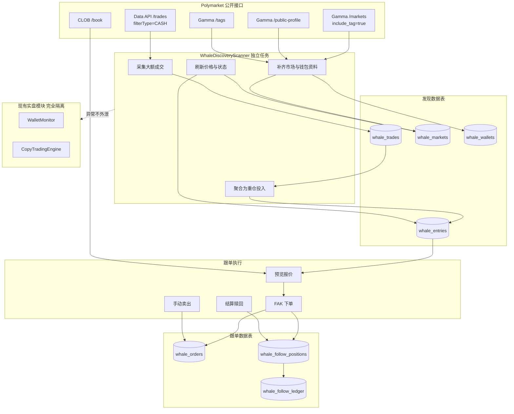
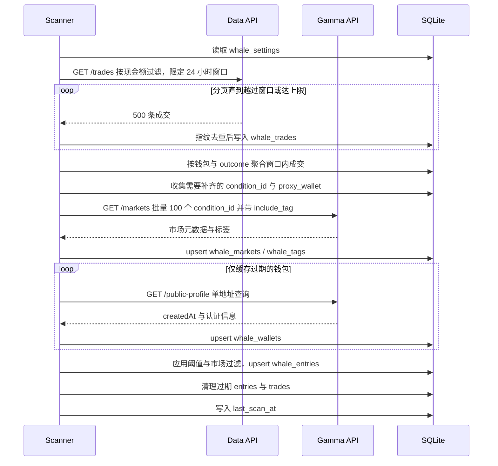

# Polymarket 巨鲸重仓投入发现与跟单功能实现文档 V1

本文档面向直接实现，覆盖数据源验证、识别算法、数据模型、API、页面、执行链路、测试与回滚。实现者可按第 14 章分期顺序推进，不需要再回头做产品决策。

---

## 1. 结论与实施边界

### 1.1 需求理解

系统需要一个独立业务模块，持续扫描 Polymarket 全市场公开成交，找出最近 24 小时内发生在**仍可交易市场**中的大额买入，按官方标签分类展示，把同一市场两侧（Yes/No）的巨鲸合并在一张卡片里对照查看，并允许用自定义金额一键跟随买入，最后用一份完整的跟单记录追踪每一笔的投入与盈亏。

### 1.2 可行性结论

建议实施。四项关键数据能力已经过真实接口实测确认全部可用，无需链上索引、无需第三方数据源、无需登录态：

1. 全市场大额成交可直接按现金额过滤并按时间倒序分页拉取；
2. 市场的官方标签、开闭状态、结束时间、当前价格可批量获取；
3. 钱包的账号创建时间可获取，用于计算注册天数；
4. 下单、卖出、赎回链路在现有系统中已经跑通，可直接复用。

### 1.3 三项已确认的产品决策

| 决策项 | 结论 |
|---|---|
| 时间口径 | 扫描**最近 24 小时内发生**的重仓买入，且该市场当前仍可交易。不是「即将在 24 小时内结算的市场」 |
| 资金风控 | 巨鲸跟单**不设额外风控额度**，不占用自动跟单策略的敞口。只要执行钱包余额足够即可买入，金额完全由人工输入 |
| 退出方式 | 手动一键卖出 + 市场结算后自动赎回。未平仓期间按当前买一价显示浮动盈亏 |

### 1.4 对原需求的必要修正

以下七点是原始需求里没有覆盖、但不处理就会导致功能不可用或产生误导的地方。实现时必须包含。

**修正一：必须做累计聚合，不能只看单笔。**
官方接口的金额过滤只作用于单笔成交。巨鲸在盘口深度有限的市场里普遍拆单，一笔 30000 USDC 的建仓可能表现为十几笔 2000 USDC 的成交。只按单笔过滤会大量漏报，且漏掉的恰好是行为最谨慎的那批钱包。因此必须以「同钱包 + 同 outcome + 24 小时滚动窗口」做累计聚合，单笔达标或累计达标都算一次重仓投入。

**修正二：只取买入方向，并用同窗口的卖出扣减。**
全局成交接口同时返回 BUY 和 SELL。只把 BUY 计入投入，同时统计同一钱包同一 outcome 在窗口内的 SELL，用净额判断这笔重仓是否还在。巨鲸建仓两小时后就跑掉的情况很常见，如果不扣减，页面会持续推荐一个已经不存在的仓位。

**修正三：同一市场两侧都有巨鲸，是对赌不是共识。**
需求要求把同一市场的 Yes 和 No 重仓合并展示，这是对的，但合并后的语义必须写清楚。两侧都有大额买入意味着两个巨鲸在互相下注，其中一个必然亏损，这比单侧重仓的参考价值**更低**而不是更高。卡片上要显式标注「双边对赌」，并展示两侧金额对比。另外，如果**同一个钱包**同时在一个市场买了两边，那大概率是做市或对冲，不是方向性判断，必须标记为「疑似做市/对冲」并在默认排序中降权。

**修正四：必须展示价格劣化。**
巨鲸的买入价和你看到列表时的当前价之间可能已经拉开很大差距——大额买入本身就会推动价格。以 0.52 买入、现价 0.61 的信号，跟进去的期望收益和巨鲸完全不同。列表和跟单预览都必须展示劣化幅度（分差与百分比），并支持按劣化幅度过滤，超过阈值时在确认弹窗中额外警示。

**修正五：距结束时间是主要字段，不是附属信息。**
体育和电竞市场的 `endDate` 经常只剩几十分钟甚至十几分钟。一个只剩 8 分钟结束的比赛，即使有巨鲸重仓也基本没有跟单价值，而且临近结算时盘口会急剧变薄导致滑点失控。「距结束」必须是列表的主要列，并提供最小剩余时间过滤（默认 30 分钟）。

**修正六：注册天数的口径必须写明。**
`public-profile.createdAt` 是 Polymarket **账号创建时间**，不是该地址的链上首次交易时间，也不代表资金的真实历史。一个 3 天前注册的账号可能是老玩家的新小号，也可能是真正的新手。这个字段只作为参考信号展示，不参与任何自动过滤或评分，界面上要标注口径。

**修正七：不设风控，但要有防误操作。**
按已确认决策不引入额度池，但「金额完全手动输入 + 一键买入」的组合有真实的误操作风险（多打一个零就是十倍资金）。保留两道与风控无关的护栏：可配置的单笔跟单金额上限（默认 200 USDC，超过则接口直接拒绝）、执行前必须提交固定确认文案。这两道都不限制资金总量，只防手滑。

### 1.5 非目标

V1 不做：自动跟随巨鲸买入（必须人工点击）、自动跟随巨鲸卖出、巨鲸钱包的历史胜率评分与排行、跨市场套利识别、限价挂单、多执行钱包。巨鲸钱包的长期质量评估属于[钱包发现与评分系统](wallet-discovery-scoring-design-v1.md)的范围，本模块不重复建设。

---

## 2. 目标与成功标准

### 2.1 目标

1. 持续发现最近 24 小时内、仍可交易市场中的大额买入，延迟不超过 2 分钟；
2. 按 Polymarket 官方标签（体育、电竞等）分类筛选；
3. 同一市场的两侧巨鲸合并为一张卡片，一次看全双边信息；
4. 每个巨鲸展示注册天数、买入价、现价、买入总金额、买入日期、价格劣化；
5. 支持自定义金额一键跟随买入，预览阶段给出结算盈利比与全部成本；
6. 支持手动一键卖出，结算后自动赎回；
7. 提供完整跟单记录，逐笔追踪投入与盈亏。

### 2.2 成功标准

- 发现覆盖：对已知发生过大额买入的市场，抽样核对漏报率低于 5%；
- 数据准确：列表展示的买入价、金额、时间与官方页面一致；
- 隔离性：巨鲸模块任何异常都不影响现有持仓监控、自动跟单、平仓和赎回；
- 执行正确：跟单买入后，`copy` 侧的自动策略数据完全不受影响，巨鲸持仓与自动策略持仓在各自页面互不串扰；
- 记录完整：每一笔跟单从买入到最终退出都能在记录页还原出投入、费用、退出方式与最终盈亏。

---

## 3. 现有系统适配评估

### 3.1 可直接复用

| 能力 | 位置 | 说明 |
|---|---|---|
| HTTP 客户端与错误处理 | `backend/polymarket.py` `PolymarketClient._get_json` | 已处理 429 与 `Retry-After` |
| 盘口读取 | `PolymarketClient.fetch_order_book` | 返回 `best_bid/best_ask/tick_size/min_order_size/neg_risk` |
| 成交指纹去重 | `polymarket.fingerprint_trades` | 重叠轮询下的稳定去重思路可直接照搬 |
| 时间与数值解析 | `polymarket.parse_datetime` / `to_decimal` | |
| FAK 下单与签名 | `backend/trading.py` `UnifiedPolymarketTrader` | `prepare_market` / `submit_prepared_market`，含授权自修复 |
| 手续费计算 | `UnifiedPolymarketTrader._fee_for_trade` | |
| 链上对账 | `onchain_outcome_balance` / `onchain_collateral_balance` / `onchain_redemption_payout_rate` | |
| 赎回执行 | `start_redemption` / `wait_redemption` | |
| 执行账户配置 | `models.ExecutionAccount` | 密钥引用、签名类型、资金地址、余额 |
| 预览+确认两步模式 | `main.py` 的 `preview_force_buy` / `execute_force_buy` | 交互模式与过期校验可照搬 |
| 数据库会话 | `backend/db.py` `Database.sessions()` | |

### 3.2 不能复用的部分与原因

**`CopyTradingEngine._apply_result` 不可复用。** 该方法在 `backend/copy_trading.py:1666` 起，直接读写 `CopyPosition`，并写入 `CopyLedger`，而 `CopyLedger.subscription_id` 是非空外键。巨鲸跟单不属于任何 `CopySubscription`，无法满足该约束。巨鲸模块需要一份结构对等、但落在自己表上的成交对账实现。

**`copy_orders` 表不做复用。** 原本可以给该表加 `source="whale"` 与一个可空的 `whale_position_id`，但既然对账逻辑本来就要重写，复用表结构带来的收益只剩下省一张建表，代价却是：一张表同时被自动引擎、演练和巨鲸三个来源写入，任何将来忘记加 `source` 过滤的查询都会造成实盘数据污染。因此 V1 采用独立的 `whale_orders` / `whale_fills` 表，完全不修改任何现有实盘表结构。这一决定的直接好处是本模块的 alembic 迁移是纯新增，回滚只需删表。

**`process_execution_redeemable_positions` 不可复用。** 该方法（`copy_trading.py:814`）按 `subscription_id` 查询 `CopyPosition`。巨鲸模块需要一份针对 `whale_follow_positions` 的平行实现，但其中的判定顺序（Data API 可赎回状态 → 链上派息率 → 链上余额归零对账）应当完整照搬，这套顺序处理了 Gamma 与链上状态不同步的真实问题。

### 3.3 隔离要求

- 巨鲸扫描器作为独立 asyncio task 运行，异常只写入自身的健康状态，绝不向上抛到 `WalletMonitor` 或 `CopyTradingEngine`；
- 巨鲸模块不写任何 `watched_wallets`、`current_positions`、`position_events`、`copy_*` 表；
- 巨鲸模块与自动策略共用同一个执行钱包和同一个 `UnifiedPolymarketTrader` 构建方式，但各自持有独立实例，避免一方的客户端失效影响另一方；
- 关闭巨鲸模块（配置开关）后，系统其余部分行为与当前完全一致。

---

## 4. 数据源与可行性验证

本章所有接口与字段均已通过真实请求验证，实现时可直接按此编码。

### 4.1 全市场大额成交（发现入口）

```
GET https://data-api.polymarket.com/trades
    ?filterType=CASH
    &filterAmount=<最小现金额 USDC>
    &start=<起始 unix 秒>
    &limit=500
    &offset=<分页偏移>
    &takerOnly=false
```

- `filterType=CASH` + `filterAmount` 按**单笔成交现金额**（`size × price`）过滤，单位 USDC；
- 结果按 `timestamp` 倒序；
- `start` 为 unix 秒，可限定 24 小时窗口；
- `offset` 分页有效。

实测返回字段：

```json
{
  "proxyWallet": "0x38337de21ff0bb0a11a40761507d51e318d633d1",
  "side": "BUY",
  "asset": "26427821257179148164999280219860796233160861172117780786020607343230632480180",
  "conditionId": "0x3640b1eee9454fd27dac2ad95834d03ef623859b9f8b358148d7e840b3808351",
  "size": 20000,
  "price": 0.56,
  "timestamp": 1786886550,
  "title": "LoL: Movistar KOI vs Natus Vincere (BO3) - LEC Regular Season",
  "slug": "lol-mkoi-navi-2026-08-16",
  "icon": "https://...",
  "eventSlug": "lol-mkoi-navi-2026-08-16",
  "outcome": "Movistar KOI",
  "outcomeIndex": 0,
  "name": "SineNooneEI",
  "pseudonym": "Any-Keystone",
  "transactionHash": "0x3163a965..."
}
```

注意 `size` 是**份额**不是金额，成交现金额为 `size × price`。上例为 20000 × 0.56 = 11200 USDC。

### 4.2 市场元数据与官方标签

```
GET https://gamma-api.polymarket.com/markets
    ?condition_ids=<id1>&condition_ids=<id2>...
    &include_tag=true
```

`include_tag=true` 是取到 `tags` 的必要参数，缺省不返回。单次请求的 `condition_ids` 控制在 100 个以内（与现有 `MARKET_RESOLUTION_BATCH_SIZE` 一致）。

本模块要用到的字段：

| 字段 | 用途 |
|---|---|
| `conditionId` | 主键 |
| `question` | 市场标题 |
| `slug` / `events[0].slug` | 跳转链接 |
| `icon` / `image` | 卡片图标 |
| `tags` | 官方标签数组，元素含 `id / label / slug` |
| `closed` / `active` / `acceptingOrders` | 市场是否仍可交易 |
| `endDate` | 结束时间，用于算距结束 |
| `outcomes` | outcome 名称数组，如 `["Movistar KOI","Natus Vincere"]` |
| `outcomePrices` | 与 `outcomes` 同序的当前价 |
| `clobTokenIds` | 与 `outcomes` 同序的 asset id |
| `bestBid` / `bestAsk` | 参考价（真实下单仍以 `fetch_order_book` 为准） |
| `negRisk` | 下单时选择 Exchange 适配器 |
| `orderMinSize` | 最小下单份额，实测常见值 5 |
| `orderPriceMinTickSize` | 最小价格步进 |
| `liquidity` / `volume24hr` | 流动性过滤 |
| `feeSchedule` | 手续费参数，形如 `{"exponent":1,"rate":0.05,"takerOnly":true,"rebateRate":0.15}` |

### 4.3 官方标签字典

```
GET https://gamma-api.polymarket.com/tags?limit=200&order=id&ascending=true
GET https://gamma-api.polymarket.com/tags/slug/<slug>
```

已确认的关键标签：

| slug | id | label |
|---|---|---|
| `sports` | 1 | Sports |
| `esports` | 64 | Esports |
| `politics` | 2 | Politics |
| `video-games` | 3 | video games |

标签体系是层级的，一个电竞市场同时带 `Esports` 和更细的联赛标签。V1 的分类过滤基于市场实际返回的 `tags` 数组做包含匹配，不做层级推导。标签字典每 24 小时刷新一次落库，界面上的分类选项从库里读，保证新出现的官方标签能自动出现在筛选器中。

### 4.4 钱包注册信息

```
GET https://gamma-api.polymarket.com/public-profile?address=<proxyWallet>
```

实测返回：

```json
{
  "createdAt": "2026-03-27T00:18:03.788884Z",
  "proxyWallet": "0x0000...",
  "pseudonym": "Whirlwind-Catalogue",
  "name": "0x0000...-1774570683676",
  "verifiedBadge": false,
  "takerTier": 0,
  "takerTierName": "Tier 0",
  "weightedVolume": 0
}
```

- 注册天数 = `now − createdAt`，向下取整到天；
- `verifiedBadge`、`takerTierName`、`weightedVolume` 一并落库展示，它们比注册天数更能反映账号的真实活跃度；
- 该接口是**单地址**查询，没有批量版本。这是本模块最主要的请求量来源，必须按第 8.3 节的缓存策略控制调用次数；
- 现有 `PolymarketClient.resolve_profile` 已经在调这个接口，但它丢弃了 `createdAt`。新增独立方法 `fetch_public_profile`，不要修改 `resolve_profile` 的现有行为。

### 4.5 数据口径与已知限制

- **公开成交只反映已成交**，看不到巨鲸的未成交挂单，也看不到它的完整意图；
- **`proxyWallet` 不等于自然人**，同一个人可能操作多个地址，多个地址的重仓可能是同一个决策；
- **无法区分自主交易与转入仓位**，本模块只统计成交，转入不会出现，这一点对 24 小时窗口影响很小；
- **`createdAt` 是账号创建时间**，见 1.4 修正六；
- **`outcomePrices` 是 Gamma 的缓存价**，用于列表展示足够，但任何下单决策必须用 `fetch_order_book` 的实时盘口；
- **接口限速**：Polymarket 对公开接口有速率限制，返回 429 时 `PolymarketClient` 已解析 `Retry-After`，扫描器必须遵守并退避。

---

## 5. 总体架构



模块清单：

| 文件 | 职责 |
|---|---|
| `backend/whale.py` | 新增。扫描器 `WhaleDiscoveryScanner`、聚合算法、跟单执行器 `WhaleFollowExecutor` |
| `backend/models.py` | 新增 7 张 `whale_` 表模型，不修改任何现有模型 |
| `backend/schemas.py` | 新增巨鲸相关请求/响应模型 |
| `backend/polymarket.py` | 新增 `fetch_large_trades` / `fetch_markets_with_tags` / `fetch_public_profile` / `fetch_tags`，不修改现有方法 |
| `backend/main.py` | 注册巨鲸路由，在 `lifespan` 中启动扫描器 |
| `backend/alembic/versions/0022_whale_discovery.py` | 纯新增建表迁移 |
| `app/whales/page.tsx` | 新增巨鲸发现页 |
| `app/whales/records/page.tsx` | 新增跟单记录页 |
| `app/components/PolyCopyShell.tsx` | 导航新增入口 |

---

## 6. 重仓投入识别算法

### 6.1 时间窗口

滚动 24 小时窗口，窗口起点 `window_start = now − 24h`。每轮扫描重新计算窗口，落在窗口外的成交不参与聚合但保留在 `whale_trades` 中，由清理任务按第 8.5 节删除。

### 6.2 双阈值

一条重仓投入满足以下任一条件即入库：

- **单笔阈值** `single_trade_threshold_usdc`：窗口内存在一笔成交现金额 ≥ 该值。默认 10000。
- **累计阈值** `cumulative_threshold_usdc`：窗口内同钱包同 outcome 的买入现金额总和 ≥ 该值。默认 10000。

采集时向接口传的 `filterAmount` 不能等于单笔阈值，否则拆单永远采不到。采集阈值单独配置为 `collect_filter_amount_usdc`，默认 1000，即先把所有 1000 USDC 以上的成交拉回来，再在本地做双阈值判定。这个值直接决定请求量与漏报率的权衡，可调。

### 6.3 聚合规则

聚合键为 `(proxy_wallet, asset_id)`，即一个钱包在一个 outcome 上的投入。计算：

```
buy_trades      = 窗口内该键的所有 BUY
sell_trades     = 窗口内该键的所有 SELL
gross_buy_usdc  = Σ(buy.size × buy.price)
gross_buy_size  = Σ(buy.size)
sold_size       = Σ(sell.size)
sold_usdc       = Σ(sell.size × sell.price)
avg_buy_price   = gross_buy_usdc / gross_buy_size
net_size        = gross_buy_size − sold_size
net_ratio       = net_size / gross_buy_size
max_single_usdc = max(buy.size × buy.price)
first_buy_at    = min(buy.timestamp)
last_buy_at     = max(buy.timestamp)
trade_count     = len(buy_trades)
```

`avg_buy_price` 是份额加权均价，不是简单价格平均，这一点在拆单价格分散时差别很大。

**投入状态** 由 `net_ratio` 决定：

| 状态 | 条件 | 界面表现 |
|---|---|---|
| `holding` | `net_ratio > 0.8` | 正常展示 |
| `reduced` | `0.2 < net_ratio ≤ 0.8` | 标注「已减仓 X%」，排序降权 |
| `exited` | `net_ratio ≤ 0.2` | 默认隐藏，可通过开关查看 |

阈值 0.8 / 0.2 写入配置项 `holding_ratio_threshold` / `exited_ratio_threshold`。

### 6.4 市场未关闭判定

一个市场进入结果集必须同时满足：

```
closed == false
AND active == true
AND acceptingOrders == true
AND max(outcomePrices) < 0.999
AND (endDate 为空 OR endDate > now + min_remaining_minutes)
```

`min_remaining_minutes` 默认 30。

胜负已分过滤：任一 `outcomePrices` 达到 `SETTLED_PRICE_THRESHOLD`（0.999）时市场排除。赛果已定的市场接口上往往仍是 `closed=false`、`acceptingOrders=true`，报价只是停在 0.9995 这类「买一 0.999 / 卖一 1.000」的中间价上——剩余空间已小于最小报价单位，跟进只会亏手续费，所以判定用阈值而不是严格等于 1。0.9885 这种真实高概率但仍有交易空间的市场保留。除了发现列表的准入判定，跟单买入报价 `quote_follow` 也会以同样规则拒绝，避免用户从缓存卡片打进已定局的市场；卖出与赎回路径不受影响。`outcomePrices` 缺失或为空时不做该过滤。

前端 `formatPrice` 保留 4 位小数：按 3 位四舍五入会把 0.9995 显示成 `1`、0.0005 显示成 `0.001`，让未结算的贴顶报价看起来像已经结算。注意 `endDate` 可能返回纯日期字符串 `YYYY-MM-DD`（现有 `fetch_market_end_date` 已经处理过这个坑），遇到纯日期时按「结束时间未知」处理，不参与剩余时间过滤，但要在界面标注。

流动性过滤：`liquidity < min_liquidity_usdc`（默认 5000）的市场排除，这类市场即使有巨鲸也无法跟进。

### 6.5 市场级合并

按 `condition_id` 把投入聚合成一张卡片：

```
market
├── condition_id / title / icon / slug / event_slug / tags
├── end_date / remaining_seconds / liquidity / volume_24h
├── total_whale_usdc            所有合格投入的 gross_buy_usdc 之和
├── whale_wallet_count          去重钱包数
├── both_sides                  合格投入覆盖的 outcome_index 数量 ≥ 2
├── dominant_side               金额较大的一侧
├── side_imbalance_ratio        较大侧金额 / 总金额
└── sides[]                     按 outcome_index 分组
    ├── outcome_index / outcome / asset_id
    ├── current_price / best_bid / best_ask
    ├── side_total_usdc / side_wallet_count
    └── entries[]               该侧的巨鲸列表
        ├── proxy_wallet / display_name
        ├── wallet_created_at / wallet_age_days / verified_badge / taker_tier_name
        ├── gross_buy_usdc / gross_buy_size / avg_buy_price
        ├── max_single_usdc / trade_count
        ├── first_buy_at / last_buy_at
        ├── status / net_ratio
        ├── price_delta_cents / price_delta_percent
        └── hedged                该钱包在本市场是否两侧都有仓
```

只要任一侧有合格投入，市场就进入结果集。需求要求的「Yes 和 No 都有重仓时合并在一个市场中一次看到两边」由 `sides[]` 天然满足，不需要额外的合并逻辑。

### 6.6 双边对赌与疑似做市

- `both_sides == true` 时，卡片顶部展示「双边对赌」标记，并按 1.4 修正三的语义说明这**降低**而非提高参考价值；
- 计算 `side_imbalance_ratio`，越接近 0.5 说明双方越势均力敌，参考价值越低；
- 对每个钱包检查它在本 `condition_id` 下是否出现在 ≥ 2 个 `outcome_index`，是则该钱包所有条目的 `hedged = true`，展示「疑似做市/对冲」标记，并在默认排序中排到该侧末尾。

### 6.7 价格劣化

对每条投入，用该 outcome 的当前价与巨鲸均价比较：

```
price_delta_cents   = (current_price − avg_buy_price) × 100
price_delta_percent = (current_price − avg_buy_price) / avg_buy_price × 100
```

正值表示现在跟进比巨鲸买得贵。`price_delta_cents > max_price_delta_cents`（默认 5）的条目在列表中标红，并在跟单确认弹窗中追加一段警示文案。这个阈值只影响提示，不阻断买入。

### 6.8 排序

默认排序键，从主到次：

1. 未标记 `hedged` 的优先；
2. `status == holding` 优先于 `reduced`；
3. `total_whale_usdc` 降序；
4. `last_buy_at` 降序。

界面额外提供「按距结束时间升序」「按单钱包最大投入降序」「按价格劣化升序」三种排序。

---

## 7. 数据模型

全部新增，前缀统一为 `whale_`，不修改任何现有表。金额与份额统一使用 `DECIMAL_TYPE = Numeric(38, 18)`，比率使用 `PERCENT_TYPE = Numeric(5, 2)`，时间统一存 UTC naive datetime，与现有模型保持一致。

### 7.1 `whale_settings`

单例配置表，`CheckConstraint("id = 1")`。

| 字段 | 类型 | 默认 | 说明 |
|---|---|---|---|
| `id` | Integer PK | 1 | |
| `enabled` | Boolean | true | 总开关，关闭后扫描器不工作 |
| `window_hours` | Integer | 24 | 滚动窗口小时数 |
| `collect_filter_amount_usdc` | DECIMAL | 1000 | 传给接口的 `filterAmount` |
| `single_trade_threshold_usdc` | DECIMAL | 10000 | 单笔重仓阈值 |
| `cumulative_threshold_usdc` | DECIMAL | 10000 | 累计重仓阈值 |
| `min_liquidity_usdc` | DECIMAL | 5000 | 市场最小流动性 |
| `min_remaining_minutes` | Integer | 30 | 距结束最小分钟数 |
| `max_price_delta_cents` | DECIMAL | 5 | 价格劣化警示阈值（美分） |
| `holding_ratio_threshold` | PERCENT | 80 | 持有状态下限 |
| `exited_ratio_threshold` | PERCENT | 20 | 退出状态上限 |
| `scan_interval_seconds` | Integer | 60 | 扫描间隔 |
| `profile_cache_hours` | Integer | 24 | 钱包资料缓存时长 |
| `trade_retention_hours` | Integer | 72 | 原始成交保留时长 |
| `max_follow_amount_usdc` | DECIMAL | 200 | 单笔跟单金额上限（防误操作） |
| `follow_slippage_cents` | DECIMAL | 3 | 跟单买入允许滑点（美分） |
| `sell_slippage_cents` | DECIMAL | 3 | 卖出允许滑点（美分） |
| `auto_redeem` | Boolean | true | 结算后自动赎回 |
| `last_scan_at` | DateTime | null | 健康状态 |
| `last_scan_error` | Text | null | 健康状态 |
| `consecutive_failures` | Integer | 0 | 健康状态 |
| `created_at` / `updated_at` | DateTime | | |

约束：`single_trade_threshold_usdc >= collect_filter_amount_usdc`、`cumulative_threshold_usdc >= collect_filter_amount_usdc`、`exited_ratio_threshold < holding_ratio_threshold`、`max_follow_amount_usdc > 0`。

### 7.2 `whale_trades`

原始大额成交，去重后落库。

| 字段 | 类型 | 说明 |
|---|---|---|
| `id` | Integer PK | |
| `fingerprint` | String(64) | 唯一，去重键 |
| `proxy_wallet` | String(42) | |
| `asset_id` | String(100) | |
| `condition_id` | String(66) | |
| `side` | String(4) | BUY / SELL |
| `size` | DECIMAL | 份额 |
| `price` | DECIMAL | |
| `amount` | DECIMAL | `size × price`，冗余存储便于聚合 |
| `outcome` | String(200) | |
| `outcome_index` | Integer | |
| `title` | Text | |
| `market_slug` | String(500) | |
| `event_slug` | String(500) | |
| `icon_url` | Text | |
| `display_name` | String(200) | 接口返回的 `name` 或 `pseudonym` |
| `transaction_hash` | String(100) | |
| `timestamp` | DateTime | 成交时间 |
| `imported_at` | DateTime | |

索引：`uq_whale_trades_fingerprint(fingerprint)` 唯一；`ix_whale_trades_time(timestamp)`；`ix_whale_trades_wallet_asset_time(proxy_wallet, asset_id, timestamp)`；`ix_whale_trades_condition_time(condition_id, timestamp)`。

指纹算法照搬 `polymarket.fingerprint_trades` 的思路，基串为 `proxy_wallet|transaction_hash|asset_id|side|price|size`，同基串出现多次时追加序号后做 sha256。注意全局成交接口与钱包成交接口存在同一笔交易被重复返回的情况，序号计数必须在**单轮采集内**统计，不能跨轮，否则重叠窗口会把同一笔算成两笔。稳妥做法是：单轮内按基串计数生成候选指纹，插入时用 `INSERT OR IGNORE` 语义靠唯一约束兜底。

### 7.3 `whale_markets`

市场元数据缓存。

| 字段 | 类型 | 说明 |
|---|---|---|
| `condition_id` | String(66) PK | |
| `title` | Text | |
| `market_slug` | String(500) | |
| `event_slug` | String(500) | |
| `icon_url` | Text | |
| `outcomes_json` | Text | `outcomes` 原样 JSON |
| `outcome_prices_json` | Text | `outcomePrices` 原样 JSON |
| `clob_token_ids_json` | Text | `clobTokenIds` 原样 JSON |
| `tags_json` | Text | `[{"id","label","slug"}]` |
| `closed` / `active` / `accepting_orders` | Boolean | |
| `neg_risk` | Boolean | |
| `end_date` | DateTime nullable | |
| `end_date_is_date_only` | Boolean | 命中纯日期时为 true |
| `liquidity` / `volume_24h` | DECIMAL | |
| `best_bid` / `best_ask` | DECIMAL nullable | |
| `order_min_size` | DECIMAL | |
| `tick_size` | DECIMAL | |
| `fee_rate` / `fee_exponent` | DECIMAL | 来自 `feeSchedule` |
| `refreshed_at` | DateTime | |

索引：`ix_whale_markets_refreshed(refreshed_at)`、`ix_whale_markets_end_date(end_date)`。

### 7.4 `whale_tags`

标签字典，供筛选器使用。

| 字段 | 类型 |
|---|---|
| `id` | String(20) PK，官方 tag id |
| `slug` | String(200) 唯一 |
| `label` | String(200) |
| `market_count` | Integer，当前结果集中命中该标签的市场数 |
| `refreshed_at` | DateTime |

### 7.5 `whale_wallets`

钱包公开资料缓存。

| 字段 | 类型 | 说明 |
|---|---|---|
| `proxy_wallet` | String(42) PK | |
| `display_name` | String(200) | |
| `pseudonym` | String(200) | |
| `profile_created_at` | DateTime nullable | 账号创建时间 |
| `verified_badge` | Boolean | |
| `taker_tier` | Integer nullable | |
| `taker_tier_name` | String(50) nullable | |
| `weighted_volume` | DECIMAL nullable | |
| `profile_missing` | Boolean | 接口 404 时置 true，避免反复重试 |
| `refreshed_at` | DateTime | |

`wallet_age_days` 不落库，读取时用 `profile_created_at` 实时计算，避免每天都要刷新一遍。

### 7.6 `whale_entries`

聚合后的重仓投入，扫描器每轮全量重算当前窗口。

| 字段 | 类型 | 说明 |
|---|---|---|
| `id` | Integer PK | |
| `proxy_wallet` | String(42) | |
| `asset_id` | String(100) | |
| `condition_id` | String(66) | |
| `outcome` | String(200) | |
| `outcome_index` | Integer | |
| `gross_buy_usdc` / `gross_buy_size` | DECIMAL | |
| `sold_size` / `sold_usdc` | DECIMAL | |
| `net_size` | DECIMAL | |
| `net_ratio` | PERCENT | |
| `avg_buy_price` | DECIMAL | 份额加权 |
| `max_single_usdc` | DECIMAL | |
| `trade_count` | Integer | |
| `first_buy_at` / `last_buy_at` | DateTime | |
| `status` | String(20) | holding / reduced / exited |
| `hedged` | Boolean | |
| `window_start` | DateTime | 本次聚合使用的窗口起点 |
| `computed_at` | DateTime | |

索引：`uq_whale_entries_wallet_asset(proxy_wallet, asset_id)` 唯一（每轮 upsert）；`ix_whale_entries_condition(condition_id)`；`ix_whale_entries_status_amount(status, gross_buy_usdc)`。

每轮扫描结束后，删除本轮没有重算到、且 `computed_at` 早于本轮窗口起点的行。

### 7.7 `whale_orders`

跟单订单，结构对齐 `copy_orders` 但独立。

| 字段 | 类型 | 说明 |
|---|---|---|
| `id` | Integer PK | |
| `position_id` | Integer FK → `whale_follow_positions.id` nullable ON DELETE SET NULL | |
| `entry_id` | Integer nullable | 触发本次跟单的 `whale_entries.id`，仅作溯源，不设外键（entry 会被重算删除） |
| `idempotency_key` | String(128) 唯一 | |
| `source_wallet` | String(42) nullable | 被跟随的巨鲸地址 |
| `asset_id` | String(100) | |
| `condition_id` | String(66) | |
| `title` | Text | |
| `outcome` | String(200) | |
| `outcome_index` | Integer nullable | |
| `neg_risk` | Boolean | |
| `side` | String(4) | |
| `requested_size` / `requested_usdc` | DECIMAL | |
| `limit_price` | DECIMAL | 滑点后的 worst price |
| `reference_price` | DECIMAL nullable | 下单瞬间的 best ask/bid |
| `whale_avg_price` | DECIMAL nullable | 下单时巨鲸均价快照 |
| `filled_size` / `filled_usdc` / `fee_usdc` | DECIMAL | |
| `status` | String(30) | planned / signed / submitted / filled / partially_filled / unfilled / blocked / reconciliation_pending |
| `reason` | Text nullable | |
| `signed_order_hash` | String(100) nullable | |
| `execution_provider` | String(30) | 固定 `unified_sdk` |
| `external_order_id` / `external_trade_id` | String(200) nullable | |
| `created_at` / `updated_at` | DateTime | |

索引：`ix_whale_orders_position_created(position_id, created_at)`、`ix_whale_orders_status_updated(status, updated_at)`。

### 7.8 `whale_fills`

| 字段 | 类型 |
|---|---|
| `id` | Integer PK |
| `order_id` | Integer FK → `whale_orders.id` ON DELETE CASCADE |
| `fingerprint` | String(128) 唯一 |
| `external_trade_id` | String(200) nullable |
| `transaction_hash` | String(100) nullable |
| `bucket_index` | Integer nullable |
| `settlement_status` | String(30) nullable |
| `size` / `price` / `amount` / `fee_usdc` | DECIMAL |
| `timestamp` | DateTime |

### 7.9 `whale_follow_positions`

| 字段 | 类型 | 说明 |
|---|---|---|
| `id` | Integer PK | |
| `asset_id` | String(100) | |
| `condition_id` | String(66) | |
| `title` | Text | |
| `outcome` | String(200) | |
| `outcome_index` | Integer nullable | |
| `neg_risk` | Boolean nullable | |
| `market_slug` / `event_slug` | String(500) nullable | |
| `icon_url` | Text nullable | |
| `source_wallet` | String(42) nullable | 首次跟随的巨鲸 |
| `source_whale_avg_price` | DECIMAL nullable | |
| `cycle_no` | Integer | 同一 asset 平仓后再买入递增 |
| `size` | DECIMAL | 当前持有份额 |
| `cost_usdc` | DECIMAL | 当前持仓成本，含手续费 |
| `lifetime_bought_size` / `lifetime_bought_usdc` | DECIMAL | 累计买入 |
| `lifetime_sold_size` / `lifetime_sold_usdc` | DECIMAL | 累计卖出 |
| `lifetime_fee_usdc` | DECIMAL | 累计手续费 |
| `realized_pnl` | DECIMAL | 已实现盈亏 |
| `status` | String(20) | opening / open / closing / closed / redeeming / redeemed / resolved_loss |
| `opened_at` / `closed_at` | DateTime nullable | |
| `created_at` / `updated_at` | DateTime | |

索引：`uq_whale_positions_asset_cycle(asset_id, cycle_no)` 唯一；`ix_whale_positions_status(status)`；`ix_whale_positions_condition(condition_id)`。

### 7.10 `whale_follow_ledger`

逐笔流水，跟单记录页的数据来源。

| 字段 | 类型 | 说明 |
|---|---|---|
| `id` | Integer PK | |
| `position_id` | Integer FK → `whale_follow_positions.id` ON DELETE RESTRICT | |
| `order_id` | Integer FK → `whale_orders.id` ON DELETE SET NULL nullable | |
| `type` | String(30) | buy / sell / redeem / resolved_loss |
| `size` | DECIMAL | |
| `price` | DECIMAL nullable | 赎回时为 null |
| `amount_usdc` | DECIMAL | 买入为流出正值，卖出/赎回为流入正值 |
| `fee_usdc` | DECIMAL | |
| `realized_pnl` | DECIMAL | 仅卖出与赎回非零 |
| `transaction_hash` | String(100) nullable | |
| `detail` | Text nullable | |
| `timestamp` | DateTime | |

索引：`ix_whale_ledger_position_time(position_id, timestamp)`、`ix_whale_ledger_time(timestamp)`。

### 7.11 `whale_redemptions`

| 字段 | 类型 |
|---|---|
| `id` | Integer PK |
| `position_id` | Integer FK → `whale_follow_positions.id`，唯一 |
| `status` | String(30) pending / submitted / completed / failed |
| `size` | DECIMAL |
| `payout_usdc` | DECIMAL nullable |
| `transaction_hash` | String(100) nullable |
| `attempts` | Integer |
| `last_error` | Text nullable |
| `created_at` / `updated_at` | DateTime |

### 7.12 迁移

`backend/alembic/versions/0022_whale_discovery.py`，`down_revision = "0021_force_buy_overrides"`。

`upgrade()` 只做 `op.create_table` 与 `op.create_index`，并插入 `whale_settings` 的单行默认值。`downgrade()` 按外键逆序 `op.drop_table`。

由于不触碰任何现有表，本迁移在生产库上是安全的纯新增操作，回滚不会丢失任何实盘数据。注意 `data/polymarket-watch.db` 当前接近 600MB，建表本身很快，但迁移前仍应确认 `data/backups/` 有当日备份。

---

## 8. 扫描器设计

### 8.1 生命周期

`WhaleDiscoveryScanner` 的启动、停止、唤醒接口与 `CopyTradingEngine` 保持一致（`start()` / `wake()` / `stop()`），在 `main.py` 的 `lifespan` 中与 `monitor`、`copy_engine` 平级创建，挂在 `application.state.whale_scanner`。仅当 `settings.start_monitor` 为真且 `whale_settings.enabled` 为真时启动循环。

### 8.2 单轮流程



第一步的分页终止条件有三个，任一满足即停：本页最小 `timestamp` 早于 `window_start`；返回条数少于 `limit`；`offset` 超过 `max_scan_pages × limit`（默认 20 页即 10000 条）。达到页数上限时记录一条告警到 `last_scan_error`，但不视为失败。

### 8.3 请求量控制

单轮请求量估算与控制手段：

| 来源 | 每轮请求数 | 控制手段 |
|---|---|---|
| 大额成交 | 1–20 | 分页上限 20 页；`start` 参数收窄窗口 |
| 市场元数据 | 结果市场数 / 100 | 批量 100；`refreshed_at` 在 60 秒内的跳过；只刷新有合格投入的市场 |
| 钱包资料 | 新增钱包数 | 缓存 24 小时；`profile_missing` 的钱包 7 天内不再请求；单轮上限 50 个，超出的留到下一轮 |
| 标签字典 | 0 或 1 | 24 小时刷新一次 |

稳态下单轮约 5–15 个请求，60 秒一轮完全在限速范围内。遇到 `PolymarketAPIError` 且带 `retry_after` 时，按该值休眠后重试当前步骤，最多 3 次；连续失败则本轮中止，`consecutive_failures += 1`，下一轮间隔按指数退避（上限 `settings.max_backoff_seconds`）。

**增量优化**：记录上一轮成功采集到的最新 `timestamp`，下一轮的 `start` 取 `max(window_start, last_timestamp − 120s)`，回退 120 秒覆盖乱序与延迟入账。这能把稳态下的成交采集压到 1–2 页。首轮或距上次成功超过窗口长度时退化为全窗口拉取。

### 8.4 故障隔离

- 扫描循环的 `try` 覆盖整个 `tick()`，捕获 `Exception` 后只写 `whale_settings.last_scan_error` 与 `consecutive_failures`，不重新抛出；
- 读取类请求复用 `application.state.polymarket_client`，它是无状态的 HTTP 封装且已有 429 处理，不需要为巨鲸模块单开一个；但**下单必须使用独立的 `UnifiedPolymarketTrader` 实例**，不共享 `CopyTradingEngine._trader_cache`，避免一方的 SDK 客户端失效连累另一方；
- 扫描器不持有任何跨请求的数据库事务，每个步骤独立 `async with database.sessions()`，避免长事务阻塞 SQLite 上的实盘写入；
- 由于 SQLite 单写者限制，聚合步骤的批量 upsert 要分批提交（每 200 行一次），不要在一个事务里写几千行。

### 8.5 数据保留

- `whale_trades`：`timestamp` 早于 `now − trade_retention_hours`（默认 72 小时）的删除，每轮扫描末尾执行；
- `whale_entries`：`computed_at` 早于本轮 `window_start` 的删除；
- `whale_markets` / `whale_wallets`：不删，作为长期缓存，体积可控；
- `whale_orders` / `whale_follow_positions` / `whale_follow_ledger` / `whale_redemptions`：永不自动删除，是资金记录。

---

## 9. 跟单买入执行链路

### 9.1 两步确认

沿用 `preview_force_buy` / `execute_force_buy` 的模式（`main.py:1771` 起）：预览生成一次性 `confirmation_id` 存入 `application.state.whale_follow_previews`（内存字典），5 分钟过期，执行时 `pop` 出来校验后立即失效。

### 9.2 预览计算

输入：`asset_id`、`amount_usdc`（用户自定义）、可选 `entry_id`（溯源用）。

计算步骤：

```
1. 校验 amount_usdc > 0 且 ≤ max_follow_amount_usdc          防误操作
2. 校验执行账户 status == "ready" 且 signature_type ∈ {1,3}
3. 校验 settings.live_copy_enabled                            紧急停用开关
4. 读 whale_markets，校验市场仍可交易                          见 6.4
5. book = fetch_order_book(asset_id)，best_ask 必须存在        实时盘口
6. worst_price = 按 follow_slippage_cents 与 tick_size 上取整
7. minimum_order_usdc = book.min_order_size × worst_price
8. 校验 amount_usdc ≥ minimum_order_usdc
9. 校验 amount_usdc ≤ 执行钱包可用 pUSD 余额
10. 估算份额、手续费、盈利比
```

第 6 步的价格取整直接复用 `copy_trading.market_worst_price(best_ask, tick_size, slippage_cents, side="BUY")`，不要重新实现。

第 9 步的余额取 `ExecutionAccount.collateral_balance`，预览前先调 `refresh_execution_balance(force=True)` 刷新。按已确认决策**不扣减 `cash_reserve_usdc`**，但如果 `amount_usdc` 会使余额跌破现金保留额，在响应里返回 `reserve_warning = true`，界面提示但不阻断。

### 9.3 盈利比与费用口径

这是需求里「根据当前价格自动计算出盈利比」的精确定义，实现必须与此一致。

**手续费**。照搬 `UnifiedPolymarketTrader._fee_for_trade` 的公式：

```
effective_rate = fee_rate × (price × (1 − price)) ^ fee_exponent
fee_usdc       = shares × effective_rate
```

`fee_rate` 与 `fee_exponent` 来自市场的 `feeSchedule`（实测体育市场为 `rate=0.05, exponent=1`）。预览阶段用 `worst_price` 做保守估算，实际以成交回填为准。注意该费率只对 taker 生效，FAK 单必然是 taker。

**预估份额**：

```
estimated_shares = amount_usdc / worst_price
```

**结算盈利比**（该 outcome 结算为 1 时的净回报率）：

```
gross_payout   = estimated_shares × 1
total_cost     = amount_usdc + estimated_fee_usdc
profit_ratio   = (gross_payout − total_cost) / total_cost × 100%
```

以 0.56 买入、5 美分滑点上限、实际按 0.56 成交、费率 0.05 为例：份额 = 100 / 0.56 = 178.57，费用 = 178.57 × 0.05 × (0.56 × 0.44) = 2.20，总成本 102.20，结算回报 178.57，盈利比 = 74.7%。

**最大亏损**：`total_cost`，即该 outcome 结算为 0 时全额损失。

**与巨鲸的对比**：若传了 `entry_id`，额外返回巨鲸均价、按巨鲸均价算的盈利比、以及两者的差值，让用户直观看到晚进场损失了多少期望收益。

预览响应必须同时给出这四个数：预估份额、总成本（含费）、结算盈利比、最大亏损。只给盈利比一个数会让人误判风险。

### 9.4 执行

```
1. pop confirmation_id，校验存在、未过期、asset_id 一致
2. 重新拉盘口，若当前 best_ask > 预览的 worst_price，拒绝并要求重新预览
3. 在 whale_follow_positions 中查找同 asset_id 且 status ∈ {opening, open} 的行
   - 存在则复用，cycle_no 不变
   - 不存在则新建，cycle_no = max(同 asset 已有 cycle_no) + 1
4. 写入 whale_orders，status="planned"，idempotency_key = f"whale:{confirmation_id}"
5. trader.prepare_market(MarketTradeRequest(side="BUY", amount=amount_usdc,
                                            worst_price, neg_risk))
   成功后 status="signed"，记录 signed_order_hash
6. trader.submit_prepared_market(prepared)
7. 若 result.external_trade_id 存在但 fee_usdc == 0，重试 3 次拉取手续费
8. 调用 whale 模块自己的 apply_result 完成对账
```

第 5、6 步之间的状态落库很重要：若第 6 步抛 `TradingUnavailable`，订单可能已提交，必须置为 `reconciliation_pending` 并**绝不自动重试**，与现有演练流程的处理一致。

### 9.5 成交对账

`WhaleFollowExecutor.apply_result(order_id, result)`，逻辑对齐 `CopyTradingEngine._apply_result` 但写入巨鲸表：

```
1. result = normalize_fak_result(request, result)      复用 trading.py 的现成函数
2. 回填 whale_orders 的 status / filled_size / filled_usdc / fee_usdc /
   external_order_id / external_trade_id / reason
3. filled_size > 0 时：
   a. 按 result.fills 逐笔写 whale_fills，指纹 = sha256(order_id|trade_id|size|price|bucket)
      无 fills 时退化为单条聚合 fill
   b. 去重检查：已存在相同 external_trade_id 的 fill 则跳过，避免重复入账
   c. BUY：position.size += filled_size
            position.cost_usdc += filled_usdc + fee_usdc
            position.lifetime_bought_* 累加
            position.status = "open"
            写 whale_follow_ledger(type="buy", amount_usdc=filled_usdc+fee_usdc)
   d. SELL：sold = min(position.size, filled_size)
            cost = position.cost_usdc × sold / position.size
            proceeds = filled_usdc − fee_usdc
            position.realized_pnl += proceeds − cost
            position.size -= sold；position.cost_usdc -= cost
            position.status = "closed" if size <= 0 else "open"
            写 whale_follow_ledger(type="sell", realized_pnl=proceeds−cost)
```

`normalize_fak_result` 的复用很关键：它把经济上无意义的 FAK 尾差（BUY 侧 0.5 USDC 以内）归一化为 `filled`，否则大量正常订单会停留在 `partially_filled` 状态。

### 9.6 幂等与并发

- `idempotency_key` 唯一约束保证同一 `confirmation_id` 不会产生两笔订单；
- `WhaleFollowExecutor` 持有 `asyncio.Lock`，序列化所有下单与卖出，防止同一 position 被并发修改；
- `confirmation_id` 使用 `secrets.token_urlsafe(32)`，`pop` 语义保证一次性。

---

## 10. 卖出与赎回

### 10.1 手动卖出

同样两步确认。预览输入 `position_id` 与 `size`（或 `sell_all=true`）：

```
1. 校验 position.status ∈ {open}，size ≤ position.size
2. book = fetch_order_book(asset_id)，best_bid 必须存在
3. worst_price = market_worst_price(best_bid, tick_size, sell_slippage_cents, side="SELL")
4. 校验 size ≥ book.min_order_size
5. 估算：proceeds = size × worst_price
         fee = size × fee_rate × (worst_price × (1 − worst_price)) ^ exponent
         cost = position.cost_usdc × size / position.size
         estimated_pnl = proceeds − fee − cost
```

执行走 `MarketTradeRequest(side="SELL", amount=size, worst_price)`，`amount` 在 SELL 侧是**份额**不是金额，这是 `trading.py` 的既有约定，不要弄反。

**份额尾差处理**：部分成交后剩余份额低于市场最小下单量时无法再卖。参照 `write_off_untradeable_dust` 的做法，剩余 `size < UNTRADEABLE_DUST_SIZE` 时把持仓标记为 `closed`，剩余成本计入已实现亏损，并在流水里写明原因。

### 10.2 结算自动赎回

由扫描器的独立子任务承担（与发现扫描同一循环、不同步骤），逻辑照搬 `process_execution_redeemable_positions` 的判定顺序：

```
1. whale_settings.auto_redeem 为真且执行账户 ready
2. 取所有 status ∈ {open, redeeming} 且 size > 0 的 whale_follow_positions
3. fetch_redeemable_positions(funder_address, condition_ids=[...])
4. 对每个可赎回持仓：
   a. payout_rate = redeemable_position_payout_rate(...)
   b. payout_rate <= 0 时，用 onchain_redemption_payout_rate 二次确认
      - 返回 None：跳过，下轮再试
      - 返回 0：记为 resolved_loss，写 ledger(type="resolved_loss",
        realized_pnl = −cost_usdc)，position.status = "resolved_loss"
   c. onchain_outcome_balance == 0：说明已在别处赎回，直接对账平账
   d. 否则创建 whale_redemptions 记录，status="redeeming"，
      调 start_redemption + wait_redemption
5. 赎回成功：payout = size × payout_rate
   写 ledger(type="redeem", amount_usdc=payout, realized_pnl=payout − cost_usdc)
   position.size = 0，cost_usdc = 0，status = "redeemed"，closed_at = now
```

第 4b 步的双重确认不能省。Gamma 会在市场已经链上结算之后、`umaResolutionStatus` 变为 finalized 之前的一段时间里给出不一致的状态，只信 Gamma 会漏赎回。

赎回提交结果不明时（`RedemptionSubmissionUnknown`），记录 `last_error` 与可能的交易哈希，`attempts += 1`，**不立即重试**，下一轮先用链上余额确认状态再决定。

### 10.3 估值与盈亏口径

| 指标 | 计算 | 适用 |
|---|---|---|
| 持仓成本 | `position.cost_usdc`，含买入手续费 | 未平仓 |
| 市值 | `position.size × best_bid` | 未平仓，`best_bid` 缺失时标记「无法估值」而不是填 0 |
| 浮动盈亏 | `市值 − 持仓成本` | 未平仓 |
| 已实现盈亏 | `position.realized_pnl`，卖出与赎回累加 | 全部 |
| 总盈亏 | `已实现 + 浮动` | 未平仓 |
| 盈利比（已成交） | `realized_pnl / lifetime_bought_usdc × 100%` | 已平仓 |

`best_bid` 拿不到时必须显式返回 `valuation_status = "unavailable"`，界面显示「—」。现有 `CopyPositionRead` 已有同样的 `valuation_status` 约定，保持一致。

---

## 11. API 设计

全部挂在 `/api/whales` 前缀下，沿用现有的 `APIModel` / `DecimalNumber` 约定（`Decimal` 序列化为 `float`，`datetime` 用 `field_serializer` 输出 ISO 字符串）。

### 11.1 配置与健康状态

```
GET  /api/whales/settings         -> WhaleSettingsRead
PUT  /api/whales/settings         <- WhaleSettingsUpdate  -> WhaleSettingsRead
POST /api/whales/scan             -> {"status":"ok"|"skipped"}  手动触发一轮扫描
```

手动扫描是同步等待的：一轮扫描要几十秒，而后台循环大半时间都在跑，若发现有轮次在跑就直接返回，界面上会表现为「点了没反应、过一会儿才刷新」。所以 `scan_now()` 会比对 `WhaleSettings.updated_at` 与运行中轮次读到的配置版本——运行中的轮次已经读到最新配置就等它收尾，否则排队再补一轮，返回时保证列表能读到基于最新配置的结果。巨鲸模块被关闭或本轮扫描失败时返回 `skipped`，前端据此提示列表可能仍是上一轮结果。

`WhaleSettingsRead` 在 7.1 全部字段基础上追加：`last_scan_at`、`last_scan_error`、`consecutive_failures`、`tracked_trade_count`、`entry_count`、`market_count`。

`WhaleSettingsUpdate` 的校验与 7.1 的表约束一致，越界返回 422 并给出中文原因。

### 11.2 分类

```
GET /api/whales/tags -> list[WhaleTagRead]
```

只返回当前结果集中实际有市场命中的标签，附 `market_count`，按 `market_count` 降序。界面的分类筛选器直接渲染这个列表，加一个「全部」选项。

### 11.3 市场列表

```
GET /api/whales/markets
    ?tag_slug=<slug>              可选，官方标签过滤
    &min_amount_usdc=<n>          可选，市场总巨鲸金额下限
    &min_remaining_minutes=<n>    可选，覆盖默认
    &max_price_delta_cents=<n>    可选，价格劣化上限
    &include_exited=<bool>        默认 false
    &include_hedged=<bool>        默认 true
    &sort=<default|ending_soon|max_entry|least_delta>
    &limit=<n>&offset=<n>
-> WhaleMarketListRead
```

响应结构对应 6.5 的模型：

```
WhaleMarketListRead
├── generated_at: datetime
├── window_start: datetime
├── stale: bool                   last_scan_at 超过 3 倍扫描间隔时为 true
├── total: int
└── items: list[WhaleMarketRead]
    ├── condition_id / title / icon_url / market_slug / event_slug
    ├── polymarket_url             拼好的市场页链接
    ├── tags: list[WhaleTagRead]
    ├── end_date / remaining_seconds / end_date_is_date_only
    ├── liquidity / volume_24h
    ├── total_whale_usdc / whale_wallet_count
    ├── both_sides / dominant_outcome_index / side_imbalance_ratio
    └── sides: list[WhaleMarketSideRead]
        ├── outcome_index / outcome / asset_id
        ├── current_price / best_bid / best_ask
        ├── side_total_usdc / side_wallet_count
        └── entries: list[WhaleEntryRead]
            ├── entry_id / proxy_wallet / display_name / profile_url
            ├── wallet_created_at / wallet_age_days
            ├── verified_badge / taker_tier_name
            ├── gross_buy_usdc / gross_buy_size / avg_buy_price
            ├── max_single_usdc / trade_count
            ├── first_buy_at / last_buy_at
            ├── status / net_ratio / hedged
            └── price_delta_cents / price_delta_percent
```

`wallet_age_days` 为 `null` 表示资料尚未拉取或该地址无公开档案，界面显示「未知」，不要显示 0。

### 11.4 市场详情

```
GET /api/whales/markets/{condition_id} -> WhaleMarketDetailRead
```

在 `WhaleMarketRead` 基础上追加每条投入的原始成交明细（`whale_trades` 中该钱包该 outcome 在窗口内的逐笔），用于展开核对。

### 11.5 跟单买入

```
POST /api/whales/follow/preview
     <- {asset_id, amount_usdc, entry_id?}
     -> WhaleFollowPreviewRead

POST /api/whales/follow/execute
     <- {confirmation_id, confirmation_text: "确认真实买入"}
     -> WhaleOrderRead
```

`WhaleFollowPreviewRead`：

```
confirmation_id / expires_at
asset_id / condition_id / title / outcome / outcome_index / neg_risk
amount_usdc
best_ask / worst_price / tick_size
minimum_order_usdc
estimated_shares
estimated_fee_usdc
total_cost_usdc
profit_ratio_percent          结算盈利比
max_loss_usdc
whale_avg_price?              传了 entry_id 时
whale_profit_ratio_percent?
profit_ratio_gap_percent?
price_delta_cents?
price_delta_warning: bool     劣化超阈值
reserve_warning: bool         会跌破现金保留额
available_balance_usdc
```

错误码约定：422 参数非法（金额越界、低于最小下单）、409 状态冲突（市场已关闭、账户未就绪、确认过期、价格已变化）、502 上游接口或提交结果不明。

### 11.6 卖出

```
POST /api/whales/positions/{position_id}/sell/preview
     <- {size?, sell_all?}
     -> WhaleSellPreviewRead

POST /api/whales/positions/{position_id}/sell/execute
     <- {confirmation_id, confirmation_text: "确认真实卖出"}
     -> WhaleOrderRead
```

`WhaleSellPreviewRead`：`confirmation_id / expires_at / size / best_bid / worst_price / minimum_order_size / estimated_proceeds_usdc / estimated_fee_usdc / cost_basis_usdc / estimated_pnl_usdc / estimated_pnl_percent`。

### 11.7 跟单记录

```
GET /api/whales/positions
    ?status=<open|closed|all>&limit=&offset=
-> WhalePositionListRead

GET /api/whales/positions/{position_id} -> WhalePositionDetailRead

GET /api/whales/records
    ?start_date=&end_date=&limit=&offset=
-> WhaleRecordListRead
```

`WhalePositionRead` 字段：市场信息、`source_wallet`、`source_whale_avg_price`、`size`、`avg_cost_price`（= `cost_usdc / size`）、`cost_usdc`、`current_price`、`market_value_usdc`、`unrealized_pnl`、`realized_pnl`、`total_pnl`、`lifetime_*`、`status`、`opened_at`、`closed_at`、`valuation_status`。

`WhaleRecordListRead` 是流水视图，每行一条 `whale_follow_ledger`，join 出市场信息与订单信息，附 `summary`：

```
summary
├── total_invested_usdc        Σ 买入含费
├── total_proceeds_usdc        Σ 卖出 + 赎回
├── total_fee_usdc
├── realized_pnl
├── unrealized_pnl             未平仓合计
├── total_pnl
├── open_position_count / closed_position_count
├── win_count / loss_count / win_rate_percent    已结束仓位口径
└── average_profit_ratio_percent
```

---

## 12. 页面与交互

### 12.1 导航

在 `app/components/PolyCopyShell.tsx` 的 `navigation` 数组中，「记录」与「钱包分析」之间插入：

```ts
{ id: "whales", href: "/whales", label: "巨鲸", icon: "◈" },
```

同时把 `WorkspaceView` 联合类型加上 `"whales"`，并把 `navigation.slice(0, 4)` / `slice(4)` 的分组下标相应调整为 5，否则新入口会被分到「系统」分组下。

### 12.2 巨鲸发现页 `/whales`

**顶部工具条**：分类筛选（从 `/api/whales/tags` 动态渲染，「全部 / 体育 / 电竞 / 政治 / ...」）、重仓金额阈值输入、最小剩余时间、排序选择、「显示已退出」与「显示疑似做市」开关、手动刷新按钮、扫描健康状态指示（`stale` 为真时显示橙色「数据可能过期」）。

阈值输入框改的是 `whale_settings.cumulative_threshold_usdc`，走 `PUT /api/whales/settings`，保存后自动触发一次扫描。这满足需求里的「重仓具体金额可以设置」。

**市场卡片**。每张卡片一个市场，头部展示图标、标题、官方标签、距结束倒计时（小于 60 分钟时高亮）、总巨鲸金额、钱包数、跳转 Polymarket 的外链。若 `both_sides` 为真，头部加一枚「双边对赌」徽标，并展示两侧金额条形对比。

卡片主体是**两栏并排**（`sides` 有两个时）或单栏。每栏顶部是 outcome 名称与当前价，下面是该侧的巨鲸列表，每行一个钱包：

| 列 | 来源 |
|---|---|
| 钱包 | `display_name`，缩略地址，外链到 Polymarket 个人页 |
| 注册 | `wallet_age_days` 天，`verified_badge` 显示认证标记，hover 提示口径 |
| 买入价 | `avg_buy_price` |
| 现价 | 该侧 `current_price`，右侧小字显示 `price_delta_cents`，正值标红 |
| 买入总额 | `gross_buy_usdc` |
| 买入时间 | `last_buy_at`，北京时间；`trade_count > 1` 时显示「N 笔」可展开 |
| 状态 | `holding` 无标记；`reduced` 显示「已减仓 X%」；`hedged` 显示「疑似做市」 |
| 操作 | 「跟随买入」按钮 |

行展开后显示该钱包在窗口内的逐笔成交（时间、方向、价格、份额、金额），数据来自市场详情接口。

时间统一用北京时间显示，与现有页面一致。

**空状态**：当前阈值下没有结果时，提示「当前阈值下没有发现重仓投入」并给出「降低阈值」的快捷操作，不要显示空白。

### 12.3 跟单买入弹窗

点「跟随买入」打开，分两个阶段。

**输入阶段**：显示市场标题、outcome、巨鲸均价与当前价对比。金额输入框自定义填写，下方给三个快捷金额按钮。输入变化时防抖 400ms 调 `/follow/preview`。

**预览阶段**（这是需求里「根据当前价格自动计算出盈利比」的落点）：

```
买入价（含滑点上限）    0.56
预计份额                178.57
手续费（预估）          2.20 USDC
总成本                  102.20 USDC
─────────────────────────────
结算盈利比              +74.7%
结算可得                178.57 USDC
最大亏损                102.20 USDC
─────────────────────────────
巨鲸买入价 0.52，盈利比 +87.8%，你比巨鲸少 13.1 个百分点
```

`price_delta_warning` 为真时，在盈利比下方插入橙色警示条：「当前价已比巨鲸买入价高 4 美分，跟进成本明显上升」。`reserve_warning` 为真时插入蓝色提示条说明会跌破现金保留额。

底部是确认区：必须输入或勾选固定文案「确认真实买入」才能点执行按钮。执行中禁用按钮，成功后弹窗内展示成交结果（成交份额、均价、实付、手续费），并刷新列表与记录。

失败时按错误码给不同文案：409 价格变化时提示「市场价格已变动，请重新预览」并自动重新预览；502 时明确提示「提交结果待确认，系统不会自动重试，请到跟单记录核对」。

### 12.4 跟单记录页 `/whales/records`

**汇总卡片**行：总投入、总回收、已实现盈亏、浮动盈亏、总盈亏、胜率、平均盈利比。盈亏正负用现有配色，与「记录」页保持一致。

**当前持仓表**：市场、方向、跟随的巨鲸、买入均价、持有份额、成本、现价、市值、浮动盈亏、盈亏比、开仓时间、操作（一键卖出）。`valuation_status == "unavailable"` 的行市值与浮动盈亏显示「—」。

**历史流水表**：时间、类型（买入/卖出/赎回/结算亏损）、市场、方向、价格、份额、金额、手续费、本笔盈亏、交易哈希（外链 Polygonscan）。支持按日期范围过滤。

**逐仓明细**：点击任一持仓展开该仓位的完整流水，从首次买入到最终退出，最后一行给出这个仓位的最终结论（投入多少、回收多少、净盈亏多少、盈亏比多少）。这直接对应需求里「记录详细的信息，投入多少，盈利或者亏损多少」。

---

## 13. 配置项

### 13.1 环境变量（`.env`）

| 变量 | 默认 | 说明 |
|---|---|---|
| `POLYMARKET_WHALE_ENABLED` | `1` | 模块总开关，`0` 时扫描器不启动、路由返回 503 |
| `POLYMARKET_WHALE_SCAN_INTERVAL_SECONDS` | `60` | 扫描间隔，库内配置优先 |
| `POLYMARKET_WHALE_MAX_SCAN_PAGES` | `20` | 单轮成交分页上限 |
| `POLYMARKET_WHALE_PROFILE_BATCH_LIMIT` | `50` | 单轮钱包资料请求上限 |

在 `Settings` 中新增对应字段，`from_env` 中解析，风格与现有字段一致。

### 13.2 库内配置

`whale_settings` 表，见 7.1，全部可在页面上修改。业务阈值放库里而不是环境变量，是因为用户需要频繁调整重仓金额阈值，改环境变量要重启服务。

---

## 14. 开发分期

### 阶段 A：数据采集与发现（可独立验收）

1. `polymarket.py` 新增 `fetch_large_trades` / `fetch_markets_with_tags` / `fetch_public_profile` / `fetch_tags`；
2. `models.py` 新增 `whale_settings` / `whale_trades` / `whale_markets` / `whale_tags` / `whale_wallets` / `whale_entries`；
3. alembic `0022_whale_discovery` 建表 + 默认配置行；
4. `whale.py` 实现 `WhaleDiscoveryScanner` 的采集、补齐、聚合、清理；
5. `main.py` 注册 `/api/whales/settings`、`/tags`、`/markets`、`/markets/{id}`、`/scan`，并在 `lifespan` 启动扫描器。

验收：手动触发扫描后，`/api/whales/markets?tag_slug=esports` 能返回真实的电竞市场与巨鲸列表，字段与官方页面核对一致；停掉扫描器不影响 `npm test` 通过。

### 阶段 B：发现页面

6. `app/whales/page.tsx` 与相关组件；
7. `PolyCopyShell` 导航入口；
8. 分类筛选、阈值设置、排序、双边合并展示、逐笔展开。

验收：页面能正确合并双边巨鲸，能按体育/电竞切换，能改阈值并立即生效。

### 阶段 C：跟单买入

9. `models.py` 新增 `whale_orders` / `whale_fills` / `whale_follow_positions` / `whale_follow_ledger`；
10. `whale.py` 实现 `WhaleFollowExecutor` 的预览、执行、对账；
11. `/follow/preview` 与 `/follow/execute` 接口；
12. 跟单弹窗与盈利比展示。

验收：用最小金额做一次真实买入，`whale_orders`、`whale_fills`、`whale_follow_positions`、`whale_follow_ledger` 四张表数据自洽，链上 outcome token 余额与记录一致，且 `copy_*` 表完全没有新增行。

### 阶段 D：退出与记录

13. 新增 `whale_redemptions`，实现卖出预览/执行与结算自动赎回；
14. `/positions`、`/records` 接口；
15. `app/whales/records/page.tsx`。

验收：一笔跟单从买入到卖出（或到结算赎回）全流程结束后，记录页显示的最终盈亏与钱包 pUSD 余额变化一致。

---

## 15. 测试方案

### 15.1 后端单元测试（`backend/tests/test_whale.py`）

聚合算法（不触网，纯函数或注入假数据）：

- 单笔达标但累计不达标 → 入库；
- 单笔均不达标但累计达标 → 入库，验证拆单场景不漏报；
- 均不达标 → 不入库；
- 窗口内有 SELL → `net_ratio` 与 `status` 正确，`net_ratio ≤ 0.2` 时状态为 `exited`；
- `avg_buy_price` 是份额加权而非算术平均（构造 100 份 @0.2 与 900 份 @0.8，期望 0.74 而非 0.5）；
- 同钱包在同市场两侧都有仓 → `hedged = true`；
- 两个不同钱包分别在两侧 → `both_sides = true`、`hedged = false`；
- 市场 `closed=true` / `acceptingOrders=false` / `endDate` 剩余不足 → 被过滤；
- 市场 `outcomePrices` 任一 ≥ 0.999（含 0.9995 贴顶中间价）→ 被过滤，0.9885 与空 `outcomePrices` 不误杀；
- `endDate` 为纯日期 → `end_date_is_date_only = true` 且不被剩余时间过滤误杀；
- `price_delta_cents` 正负号方向正确。

指纹去重：

- 同一笔成交在两轮重叠采集中出现 → 只入库一次；
- 同一交易哈希下的两笔同价同量成交 → 入库两条，不被误去重。

盈利比与费用：

- 给定价格、金额、费率，`estimated_fee_usdc`、`total_cost_usdc`、`profit_ratio_percent` 与手算一致；
- 费率公式在 `price=0.5` 时取到最大值，在 `price→0` 与 `price→1` 时趋近 0。

对账：

- BUY 全部成交 → 持仓份额、成本、流水正确；
- BUY 部分成交且尾差在 0.5 USDC 内 → `normalize_fak_result` 归一化为 `filled`；
- SELL 部分平仓 → 成本按比例结转，`realized_pnl` 正确；
- SELL 全平 → 状态 `closed`；
- 重复调用 `apply_result` 同一结果 → 不产生重复 fill、不重复累加持仓；
- 赎回派息率为 0 → 记 `resolved_loss` 且亏损等于成本。

### 15.2 客户端层测试（追加到 `backend/tests/test_polymarket_client.py`）

沿用该文件现有的 `httpx.MockTransport` 注入方式，用真实的接口响应样本（可直接取本文第 4 章的实测 JSON）验证新增的四个方法：

- `fetch_large_trades` 正确拼接 `filterType` / `filterAmount` / `start` / `offset` 参数，正确解析 `size × price` 为金额，正确跳过 `side` 非 BUY/SELL 的条目；
- 分页在返回条数少于 `limit` 时终止，在最小 `timestamp` 早于窗口起点时终止，在达到页数上限时终止并返回已采集数据；
- `fetch_markets_with_tags` 在缺省 `include_tag` 时不会静默返回空标签（必须始终带上该参数）；
- `fetch_markets_with_tags` 正确按 100 个 `condition_ids` 分批；
- `fetch_public_profile` 在 404 时返回 `None` 而不是抛错，供 `profile_missing` 使用；
- 429 响应时抛出带 `retry_after` 的 `PolymarketAPIError`。

### 15.3 后端接口测试（追加到 `backend/tests/test_api.py`）

沿用现有的 `FakePolymarketClient` + `app_client_factory` 注入方式（`backend/tests/conftest.py`）。需要在 `FakePolymarketClient` 上补齐新增的四个方法，返回可配置的假数据，注意保持它与真实 `PolymarketClient` 的方法签名一致，否则测试会掩盖真实的调用错误。

- `GET /api/whales/markets` 返回结构完整，`sides` 排序稳定；
- `PUT /api/whales/settings` 越界值返回 422 且 message 为中文；
- `POST /api/whales/follow/preview` 在金额超过 `max_follow_amount_usdc` 时返回 422；
- 金额低于最小下单额时返回 422；
- 市场已关闭时返回 409；
- `execute` 使用已过期 / 已使用 / 不匹配的 `confirmation_id` 时返回 409；
- 执行账户未就绪时返回 409；
- 巨鲸模块关闭时相关路由返回 503。

### 15.4 隔离性回归测试

这是最关键的一类测试，必须显式覆盖：

- 执行一次巨鲸跟单后，`copy_orders`、`copy_positions`、`copy_ledger`、`copy_fills` 的行数完全不变；
- `GET /api/copy-trading/*` 的全部响应与跟单前一致；
- 扫描器抛出异常时，`WalletMonitor.tick()` 与 `CopyTradingEngine.tick()` 仍正常完成；
- `whale_settings.enabled = false` 时，系统行为与未引入本模块时一致。

### 15.5 前端测试（`tests/whale-discovery.test.tsx`）

用 vitest + testing-library，mock `fetch`：

- 双边市场渲染出两栏，各栏钱包数正确；
- 单边市场只渲染一栏；
- `hedged` 条目显示「疑似做市」标记；
- `wallet_age_days` 为 `null` 时显示「未知」而不是 0；
- 价格劣化为正且超阈值时该单元格有警示类名；
- 预览返回后，盈利比、总成本、最大亏损三个数都渲染出来；
- 未输入确认文案时执行按钮为禁用；
- `stale = true` 时显示数据过期提示。

### 15.6 回归命令

```bash
npm test
npm run lint
```

`npm test` 会依次跑 `typecheck`、`vitest`、`build`、渲染测试与 `pytest`。新增的 Python 文件必须通过 `ruff check` 与 `ruff format --check`。

---

## 16. 验收用例

| 编号 | 场景 | 期望 |
|---|---|---|
| A1 | 设置累计阈值 10000，触发扫描 | 列表只出现窗口内累计买入 ≥ 10000 USDC 的钱包 |
| A2 | 把阈值改为 50000 | 列表立即收窄，且配置持久化，重启后仍是 50000 |
| A3 | 选择「电竞」分类 | 只显示 `tags` 含 Esports 的市场 |
| A4 | 选择「体育」分类 | 只显示 `tags` 含 Sports 的市场 |
| A5 | 某市场 Yes 与 No 各有一个巨鲸 | 合并为一张卡片，两栏并排，头部有「双边对赌」标记 |
| A6 | 某钱包在同一市场买了两边 | 该钱包所有条目显示「疑似做市」，默认排到末尾 |
| A7 | 某巨鲸建仓后在窗口内卖掉 90% | 状态显示 `exited`，默认不出现在列表中 |
| A8 | 某市场已结算关闭 | 不出现在列表中 |
| A9 | 某市场距结束 10 分钟 | 默认过滤下不出现；把最小剩余时间设为 5 分钟后出现，且倒计时高亮 |
| A10 | 查看任一巨鲸行 | 注册天数、买入价、现价、买入总金额、买入日期五项齐全 |
| A11 | 展开某条巨鲸 | 显示该钱包在窗口内的逐笔成交，笔数与 `trade_count` 一致 |
| B1 | 点「跟随买入」输入 20 USDC | 预览显示预计份额、手续费、总成本、结算盈利比、最大亏损 |
| B2 | 输入超过 `max_follow_amount_usdc` 的金额 | 接口 422，界面提示上限，按钮禁用 |
| B3 | 输入低于市场最小下单额的金额 | 接口 422，界面给出最小可买金额 |
| B4 | 预览后等待 6 分钟再执行 | 409 确认已过期，界面自动重新预览 |
| B5 | 预览后市场价格上涨超过预览 worst price | 409 价格已变动，要求重新预览 |
| B6 | 正常执行一次买入 | 订单 `filled`，持仓、流水、fill 三处数据自洽，链上余额一致 |
| B7 | 执行买入后检查实盘表 | `copy_*` 全部表行数不变 |
| C1 | 对持仓点「一键卖出」全部 | 预览给出预计回收、手续费、成本、预计盈亏；执行后持仓 `closed` |
| C2 | 部分卖出后剩余份额低于最小下单量 | 持仓标记 `closed`，剩余成本计入已实现亏损，流水注明原因 |
| C3 | 持有到市场结算且该 outcome 获胜 | 自动赎回，流水出现 `redeem`，盈亏 = 派息 − 成本 |
| C4 | 持有到市场结算且该 outcome 落败 | 记 `resolved_loss`，亏损 = 成本，不产生赎回交易 |
| D1 | 打开跟单记录页 | 汇总显示总投入、已实现盈亏、浮动盈亏、胜率、平均盈利比 |
| D2 | 展开某个已结束仓位 | 从买入到退出的完整流水，末行给出该仓位最终净盈亏 |
| D3 | 某持仓的 `best_bid` 拿不到 | 市值与浮动盈亏显示「—」，不显示 0 |
| E1 | 断网后触发扫描 | `last_scan_error` 有记录，页面显示数据过期，现有持仓监控与自动跟单不受影响 |
| E2 | 关闭 `whale_settings.enabled` | 扫描停止，现有功能行为不变 |

---

## 17. 发布、回滚与运维

### 17.1 发布顺序

1. 备份 `data/polymarket-watch.db` 到 `data/backups/`；
2. 执行 alembic 升级到 `0022_whale_discovery`；
3. 以 `POLYMARKET_WHALE_ENABLED=0` 启动，确认现有功能完全正常；
4. 打开开关，观察一轮扫描，核对 `last_scan_at` 与列表数据；
5. 用最小金额（接近市场最小下单额）做一次真实跟单，全链路核对后再正常使用。

### 17.2 功能开关

三层开关，粒度从粗到细：

- `POLYMARKET_WHALE_ENABLED=0`：模块完全不加载，路由返回 503；
- `whale_settings.enabled = false`：扫描停止，已有数据仍可查看，跟单接口仍可用；
- `settings.live_copy_enabled = false`：全局实盘急停，跟单买入与卖出全部拒绝（与现有自动跟单共用同一开关）。

### 17.3 回滚

因为本模块是纯新增（不修改任何现有表、不修改任何现有方法的行为），回滚代价很低：

1. 设 `POLYMARKET_WHALE_ENABLED=0` 重启，即时止损；
2. 如需彻底移除，执行 alembic 降级到 `0021_force_buy_overrides`，删除全部 `whale_` 表。

注意：`whale_follow_positions` 与 `whale_follow_ledger` 是真实资金记录。降级前必须先确认没有未平仓的巨鲸持仓，或先导出这些表。降级脚本应在检测到 `size > 0` 的持仓时直接报错中止，而不是静默删表。

### 17.4 日常运维要点

- 扫描健康状态在发现页顶部可见，`consecutive_failures ≥ 3` 时页面显示红色告警；
- `whale_trades` 按 72 小时滚动清理，正常体积在数万行量级；如果发现快速膨胀，说明 `collect_filter_amount_usdc` 设得过低；
- SQLite 在本项目已接近 600MB，本模块新增表体积占比很小，但聚合步骤必须按 8.4 分批提交，避免长写事务阻塞实盘监控；
- 若 Polymarket 调整了接口字段或限速策略，扫描失败不会影响实盘，可以从容修复。

---

## 参考资料

- [Polymarket API 概览](https://docs.polymarket.com/api-reference/introduction)
- [获取成交记录](https://docs.polymarket.com/api-reference/core/get-trades)
- [获取市场列表](https://docs.polymarket.com/api-reference/core/get-markets)
- [获取标签](https://docs.polymarket.com/api-reference/core/get-tags)
- [获取公开档案](https://docs.polymarket.com/api-reference/core/get-public-profile)
- [API 访问频率限制](https://docs.polymarket.com/api-reference/rate-limits)
- 本仓库：[钱包发现与评分设计](wallet-discovery-scoring-design-v1.md)、[统一 SDK 迁移](unified-polymarket-sdk-migration-v1.md)、[自动赎回](auto-redeem-to-pusd-v1.md)
